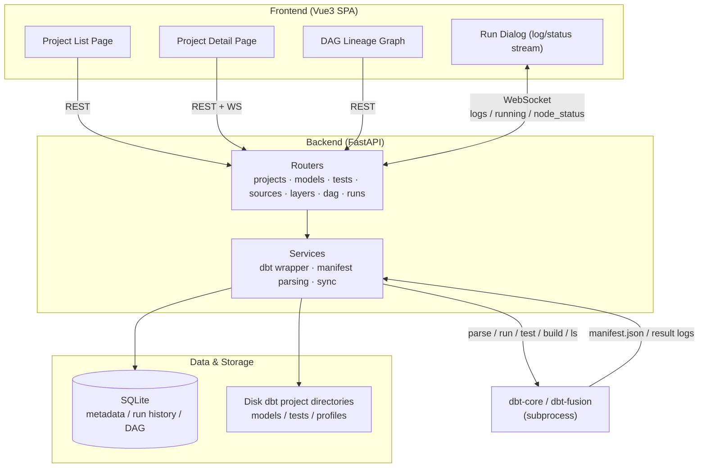

# DBT UI

A web-based DBT (dbt-core / dbt-fusion) project management interface that supports creating and managing DBT projects via UI, editing models and tests, visualizing DAG lineage graphs, and running pipelines in real time.

Tech stack: **Vue 3 + Vite + TypeScript + Element Plus** (frontend) / **FastAPI + SQLAlchemy + SQLite** (backend) / **dbt-core** (parsing, compilation, execution).

📖 **User Guide**: [中文](doc/userguide.md) | [English](doc/userguide_en.md)

---

## ✨ Features

- **Project Management**: Create / edit / delete DBT projects, auto-generate standard scaffolding (`dbt_project.yml`, `profiles.yml`, `models/`, `tests/`, etc.), auto-detect local dbt version.

  

- **Connection Configuration**: View / edit `profiles.yml` (data source connections) directly in the UI, with YAML validation on save.

  

- **Layer Configuration Management**: Visually manage layered directories under `models/` (stage / core / mart, etc.), support creating new layers, editing display names, configuring materialization strategies and target databases, renaming directories, deleting layers, with automatic sync to `dbt_project.yml`.

  

- **Sources Visualization**: UI-based management of `sources.yml`, supporting multi-source directory scanning, create / edit source, add / edit / delete tables, move tables across directories, auto-generate `{{ source() }}` references.

  

- **Model Management**: Model list (materialization strategy, run status), create / edit (CodeMirror SQL highlighting) / delete, configure materialization strategies (view/table/incremental/ephemeral), filter by layer directory.

  

- **Test Management**: Display generic and singular tests, create / edit / delete singular tests, run tests and view results.

  

- **DAG Visualization**: Interactive lineage graph (type-based coloring + status strokes), click nodes to highlight upstream/downstream, search and type filtering, click nodes to run (run/test/build/compile).

  

- **Execution**: Real-time streaming dbt log output via WebSocket, supports `--select`, cancellation during execution, run history and log viewing.

  

- **Real-time Status**: Running nodes show a blue breathing animation; each resource lights up with its final status in real time upon completion.

  

---

## 🏗 Architecture



The backend drives the dbt CLI via `subprocess` (`parse / run / test / compile / build / ls`), parses `target/manifest.json` to generate the DAG; SQLite persists metadata and run results for projects, models, and tests. During execution, the backend pushes logs and node status to the browser in real time via WebSocket.

---

## 📁 Directory Structure

```
DBT/
├── backend/
│   ├── app/
│   │   ├── main.py               # FastAPI entry + route registration
│   │   ├── config.py             # Configuration (SQLite path, project root, CORS)
│   │   ├── database.py           # SQLAlchemy engine and session
│   │   ├── models.py             # ORM models (Project/Model/Test/Source/DagEdge/RunHistory/RunResult)
│   │   ├── schemas.py            # Pydantic request/response models
│   │   ├── routers/
│   │   │   ├── projects.py       # Project CRUD + parse + profiles
│   │   │   ├── models.py         # Model CRUD + SQL read/write
│   │   │   ├── tests.py          # Test list + singular test CRUD
│   │   │   ├── sources.py        # Sources management (CRUD + table management + cross-dir move)
│   │   │   ├── layers.py         # Layer configuration management (CRUD + directory rename)
│   │   │   ├── dag.py            # DAG data
│   │   │   └── runs.py           # Execution (REST + WebSocket log/status stream + cancel)
│   │   └── services/
│   │       ├── dbt_service.py    # dbt scaffolding, parse, run, cancel, profiles
│   │       └── sync_service.py   # manifest → database sync
│   ├── requirements.txt
│   └── dbt_projects/             # UI-managed dbt project directories (generated at runtime)
├── frontend/
│   ├── src/
│   │   ├── api/                  # axios API wrappers
│   │   ├── components/           # RunDialog / DagGraph / SqlEditor
│   │   ├── views/                # ProjectList / ProjectDetail
│   │   ├── router/  stores/  types/
│   │   └── main.ts  App.vue
│   └── package.json  vite.config.ts
└── README.md
```

---

## 🚀 Getting Started

### 1. Backend (FastAPI)

```bash
# Create virtual environment and install dependencies (Python 3.9+)
python3 -m venv .venv
source .venv/bin/activate
pip install -r backend/requirements.txt

# dbt-core and dbt-sqlserver need to be installed
# pip install dbt-core dbt-sqlserver

# Start the backend
cd backend
uvicorn app.main:app --host 0.0.0.0 --port 8000 --reload
```

The backend runs at http://localhost:8000 by default. Interactive API docs are available at http://localhost:8000/docs .

### 2. Frontend (Vue3)

```bash
cd frontend
npm install
npm run dev
```

The frontend runs at http://localhost:5173 by default. In development mode, `/api` and `/ws` are proxied to the backend via Vite.

---

## 🧪 Quick Start (SQL Server Three-Tier Database)

1. Ensure you have a working SQL Server instance with three databases created: `stage_db`, `core_db`, and `mart_db`.
2. On the frontend homepage, click "New Project" and select `sqlserver` as the Adapter.
3. Enter the project details → click "Connection Configuration" to update SQL Server host, username, password, and other settings.
4. Click "Layer Configuration" to view / edit materialization strategies and target databases for stage / core / mart layers.
5. Click the "Sources" tab, create a source and add source tables to define your data sources.
6. Click "Re-parse" to generate the DAG (sample models + generic tests).
7. On the Models page click "Run" or on the DAG page click a node's "Run" button, and observe real-time logs and node status changes.

---

## 🔌 Main API Endpoints

| Method | Path | Description |
|---|---|---|
| GET/POST | `/api/projects` | Project list / create |
| PATCH/DELETE | `/api/projects/{id}` | Update / delete project |
| POST | `/api/projects/{id}/parse` | Execute dbt parse and sync DAG |
| GET/PUT | `/api/projects/{id}/profiles` | Read / save connection configuration |
| GET/POST | `/api/projects/{id}/models` | Model list / create |
| PUT/DELETE | `/api/projects/{id}/models/{id}` | Update (incl. materialization) / delete |
| GET | `/api/projects/{id}/models/{id}/sql` | Read model SQL |
| GET/POST | `/api/projects/{id}/sources` | Sources list / create source |
| PUT/DELETE | `/api/projects/{id}/sources/{name}` | Edit / delete source |
| POST | `/api/projects/{id}/sources/{name}/tables` | Add table to source |
| PUT/DELETE | `/api/projects/{id}/sources/{name}/tables/{table}` | Edit / delete source table |
| POST | `/api/projects/{id}/sources/{name}/tables/{table}/move` | Move table across source directories |
| GET/POST | `/api/projects/{id}/layers` | Layer configuration list / create layer |
| PUT/DELETE | `/api/projects/{id}/layers/{name}` | Edit / delete layer |
| POST | `/api/projects/{id}/layers/{name}/rename` | Rename layer directory |
| GET/POST | `/api/projects/{id}/tests` | Test list / create singular test |
| GET | `/api/projects/{id}/dag` | DAG nodes and edges |
| POST | `/api/projects/{id}/runs` | Synchronous execution |
| POST | `/api/projects/{id}/runs/{id}/cancel` | Cancel execution |
| WS | `/ws/projects/{id}/runs` | Real-time logs + node status stream |

---

## 📌 Notes & Limitations

- The backend physically creates / deletes dbt project directories on disk (located at `backend/dbt_projects/`).
- Connection parameters for each adapter must be configured in "Connection Configuration" according to your actual environment, otherwise execution will fail.
- Running depends on the local `dbt` command; without it, projects can still be created and parsed (parsing requires a loadable profile), but `run/test` will fail.
