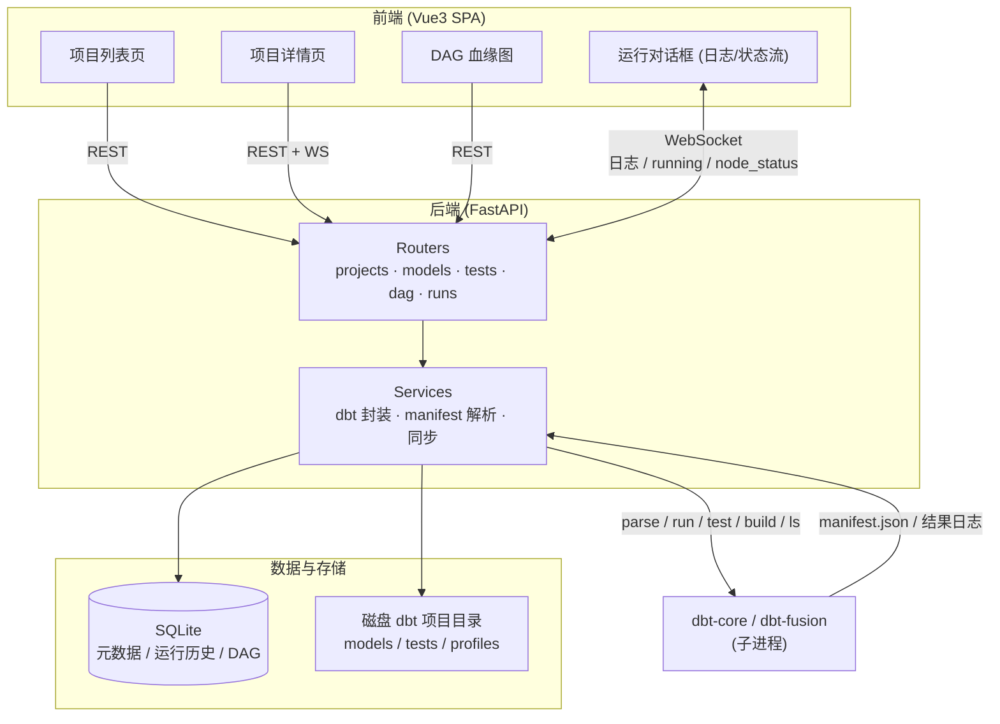

# DBT UI

一个基于 Web 的 DBT（dbt-core / dbt-fusion）项目管理界面，支持以 UI 方式创建和管理 DBT 项目、编辑模型与测试、可视化 DAG 血缘图并实时运行。

技术栈：**Vue 3 + Vite + TypeScript + Element Plus**（前端）/ **FastAPI + SQLAlchemy + SQLite**（后端）/ **dbt-core**（解析、编译、运行）。

---

## ✨ 功能特性

- **项目管理**：创建 / 编辑 / 删除 DBT 项目，自动生成标准脚手架（`dbt_project.yml`、`profiles.yml`、`models/`、`tests/` 等），自动探测本机 dbt 版本。
- **连接配置**：在 UI 中直接查看 / 编辑 `profiles.yml`（数据源连接），保存时校验 YAML。
- **Model 管理**：模型列表（物化策略、运行状态）、新建 / 编辑（CodeMirror SQL 高亮）/ 删除、配置物化策略（view/table/incremental/ephemeral）。
- **Test 管理**：展示 generic 与 singular 测试，可新建 / 编辑 / 删除 singular test，运行测试查看结果。
- **DAG 可视化**：交互式血缘图（类型着色 + 状态描边）、点击节点高亮上下游、搜索与类型筛选、点击节点运行（run/test/build/compile）。
- **运行**：通过 WebSocket 实时流式输出 dbt 日志，支持 `--select`、运行中取消，运行历史与日志查看。
- **实时状态**：运行中的节点显示蓝色呼吸动画，每个资源完成后实时点亮为最终状态。

---

## 🏗 架构



后端用 `subprocess` 驱动 dbt CLI（`parse / run / test / compile / build / ls`），解析 `target/manifest.json` 生成 DAG；SQLite 持久化项目、模型、测试的元数据与运行结果。运行过程中后端通过 WebSocket 向浏览器实时推送日志与节点状态。

---

## 📁 目录结构

```
DBT/
├── backend/
│   ├── app/
│   │   ├── main.py               # FastAPI 入口 + 路由注册
│   │   ├── config.py             # 配置（SQLite 路径、项目根目录、CORS）
│   │   ├── database.py           # SQLAlchemy 引擎与会话
│   │   ├── models.py             # ORM 模型（Project/Model/Test/Source/DagEdge/RunHistory/RunResult）
│   │   ├── schemas.py            # Pydantic 请求/响应模型
│   │   ├── routers/
│   │   │   ├── projects.py       # 项目 CRUD + parse + profiles
│   │   │   ├── models.py         # 模型 CRUD + SQL 读写
│   │   │   ├── tests.py          # 测试列表 + singular test CRUD
│   │   │   ├── dag.py            # DAG 数据
│   │   │   └── runs.py           # 运行（REST + WebSocket 日志/状态流 + 取消）
│   │   └── services/
│   │       ├── dbt_service.py    # dbt 脚手架、parse、运行、取消、profiles
│   │       └── sync_service.py   # manifest → 数据库同步
│   ├── requirements.txt
│   └── dbt_projects/             # UI 管理的各 dbt 项目目录（运行期生成）
├── frontend/
│   ├── src/
│   │   ├── api/                  # axios 接口封装
│   │   ├── components/           # RunDialog / DagGraph / SqlEditor
│   │   ├── views/                # ProjectList / ProjectDetail
│   │   ├── router/  stores/  types/
│   │   └── main.ts  App.vue
│   └── package.json  vite.config.ts
└── README.md
```

---

## 🚀 启动

### 1. 后端（FastAPI）

```bash
# 创建虚拟环境并安装依赖（Python 3.9+）
python3 -m venv .venv
source .venv/bin/activate
pip install -r backend/requirements.txt

# 需要安装 dbt-core 与对应 adapter（如 duckdb 可直接本地运行）
# pip install dbt-duckdb

# 启动后端
cd backend
uvicorn app.main:app --host 0.0.0.0 --port 8000 --reload
```

后端默认运行在 http://localhost:8000，交互式 API 文档见 http://localhost:8000/docs 。

### 2. 前端（Vue3）

```bash
cd frontend
npm install
npm run dev
```

前端默认运行在 http://localhost:5173，开发环境下 `/api` 与 `/ws` 已通过 Vite 代理到后端。

---

## 🧪 快速体验（duckdb，免外部数据库）

1. 前端首页点击「新建项目」，Adapter 选择 `duckdb`（后端会生成本地 `.duckdb` 文件，无需外部服务）。
2. 进入项目详情 → 点击「重新解析」，生成 DAG（示例模型 + generic test）。
3. 在 Models 页点「运行」或 DAG 页点节点「运行」，观察实时日志与节点状态变化。

---

## 🔌 主要接口

| 方法 | 路径 | 说明 |
|---|---|---|
| GET/POST | `/api/projects` | 项目列表 / 创建 |
| PATCH/DELETE | `/api/projects/{id}` | 更新 / 删除项目 |
| POST | `/api/projects/{id}/parse` | 执行 dbt parse 并同步 DAG |
| GET/PUT | `/api/projects/{id}/profiles` | 读取 / 保存连接配置 |
| GET/POST | `/api/projects/{id}/models` | 模型列表 / 新建 |
| PUT/DELETE | `/api/projects/{id}/models/{id}` | 更新（含物化策略）/ 删除 |
| GET | `/api/projects/{id}/models/{id}/sql` | 读取模型 SQL |
| GET/POST | `/api/projects/{id}/tests` | 测试列表 / 新建 singular test |
| GET | `/api/projects/{id}/dag` | DAG 节点与边 |
| POST | `/api/projects/{id}/runs` | 同步运行 |
| POST | `/api/projects/{id}/runs/{id}/cancel` | 取消运行 |
| WS | `/ws/projects/{id}/runs` | 实时日志 + 节点状态流 |

---

## 📌 说明与限制

- 后端会在磁盘上真实创建 / 删除 dbt 项目目录（位于 `backend/dbt_projects/`）。
- 除 duckdb 外，其他 adapter 的连接参数需在「连接配置」中按实际环境填写，否则运行会失败。
- 运行依赖本机 `dbt` 命令；未安装时项目可创建与解析（解析需能加载 profile），但 `run/test` 会失败。
