# DBT UI 用户操作手册 — SQL Server 三层分库版

> 本手册以一个完整的销售数据仓库项目为例，从零开始演示 DBT UI 的全部功能操作。
> 数据库：SQL Server，采用 **stage_db / core_db / mart_db** 三层物理分库架构。
> 所有截图保存在 `doc/userguide/` 目录下。

---

## 案例背景

假设我们有一个源业务系统运行在 **SQL Server** 上，数据库名为 `sales_db`，包含三张业务表：

| 源表 | 说明 | 主要字段 | 数据量 |
|------|------|----------|--------|
| `customer` | 客户表 | customer_id, customer_name, gender, age, city, create_date | 8 行 |
| `product` | 商品表 | product_id, product_name, category, price, create_date | 8 行 |
| `salesorder` | 订单表 | order_id, order_date, customer_id, product_id, quantity, unit_price, amount, status | 18 行 |

订单状态 `status` 取值：`completed` / `processing` / `cancelled`。

我们需要构建一个**三层分库**的数据仓库，每一层对应一个独立的物理数据库，都部署在同一个 SQL Server 实例上：

```
┌─────────────┐    ┌─────────────┐    ┌─────────────┐
│  sales_db   │ →  │  stage_db   │ →  │   core_db   │ →  │   mart_db   │
│  (源系统)    │    │  (贴源层)    │    │  (核心层)    │    │  (应用层)    │
├─────────────┤    ├─────────────┤    ├─────────────┤    ├─────────────┤
│  customer   │    │ stg_customer│    │ dim_customer│    │ sales_wide  │
│  product    │    │ stg_product │    │ dim_product │    │             │
│ salesorder  │    │stg_salesorder│    │ fact_sales  │    │             │
└─────────────┘    └─────────────┘    └─────────────┘    └─────────────┘
```

- **stage_db（Stage 层）**：从源系统 1:1 加载，做字段命名规范化和基础清洗，以表形式存在
- **core_db（Core 层）**：维度建模，组织成维度表（dimension）和事实表（fact）
- **mart_db（Mart 层）**：面向业务应用的大宽表，直接供报表/分析使用

> 三个数据库通过 SQL Server 的跨库查询（`database.schema.table`）互相访问，dbt 通过 `{{ source() }}` 和 `{{ ref() }}` 自动处理跨库引用。

---

## 目录

- [第 1 章：创建项目](#第-1-章创建项目)
- [第 2 章：分层配置管理](#第-2-章分层配置管理)
- [第 3 章：配置源系统（Sources 可视化）](#第-3-章配置源系统sources-可视化)
- [第 4 章：Stage 层 — 贴源加载（stage_db）](#第-4-章stage-层--贴源加载stage_db)
- [第 5 章：Core 层 — 维度建模（core_db）](#第-5-章core-层--维度建模core_db)
- [第 6 章：Mart 层 — 应用宽表（mart_db）](#第-6-章mart-层--应用宽表mart_db)
- [第 7 章：Macro 编写与复用](#第-7-章macro-编写与复用)
- [第 8 章：Snapshot 增量抓取](#第-8-章snapshot-增量抓取)
- [第 9 章：DAG 血缘图](#第-9-章dag-血缘图)
- [第 10 章：数据查看器（Data Viewer）](#第-10-章数据查看器data-viewer)
- [第 11 章：运行历史与日志](#第-11-章运行历史与日志)
- [附录：模型清单、架构图、常见问题](#附录模型清单架构图常见问题)

---

## 第 1 章：创建项目

### 1.1 进入系统

打开浏览器访问 DBT UI，首页展示所有项目列表。

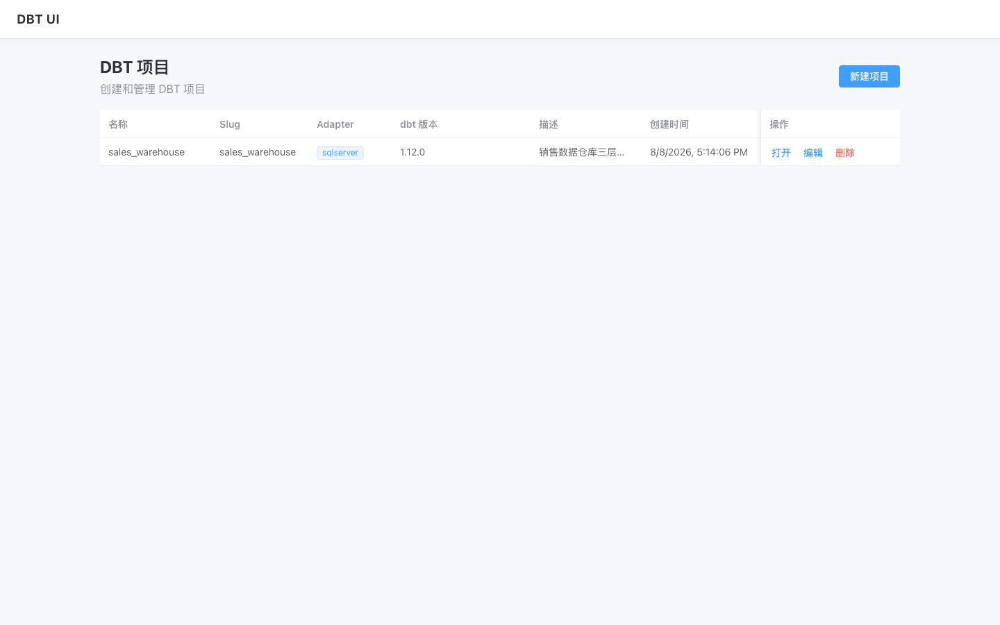

**页面说明：**
- 顶部为系统标题栏「DBT 项目」
- 中间表格列出已有项目，包含名称、Slug、Adapter、dbt 版本、描述、创建时间
- 每行右侧有「打开」「编辑」「删除」操作按钮
- 右上角「新建项目」按钮用于创建新项目

### 1.2 新建项目

点击右上角「新建项目」按钮，弹出创建对话框。

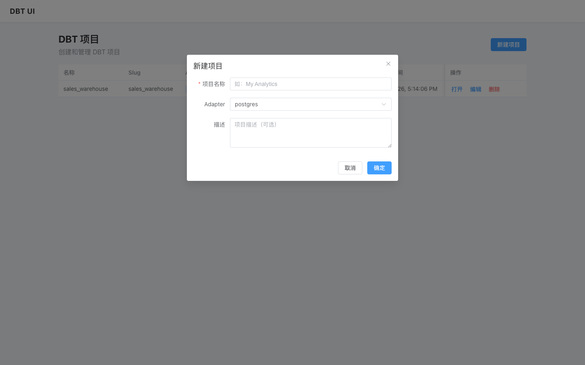

**表单字段说明：**
- **项目名称**：项目名称（仅允许字母、数字、下划线）
- **Adapter**：选择数据库适配器（本案例使用 `sqlserver`）
- **描述**：项目描述（可选）

> 支持的适配器：sqlserver、postgres、snowflake、bigquery。

### 1.3 填写项目信息

在弹窗中填写项目信息：
- 项目名称：`sales_warehouse`
- Adapter：`sqlserver`
- 描述：`销售数据仓库三层分库`

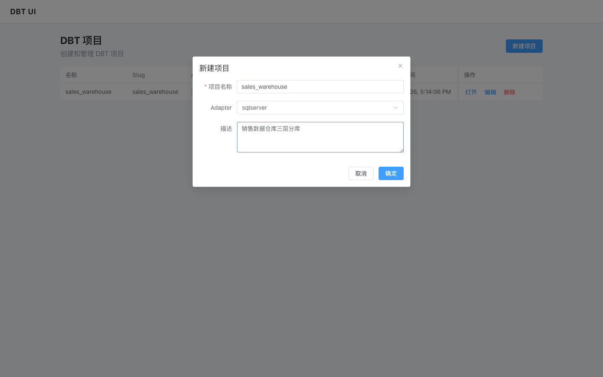

点击「确定」按钮，系统将：
1. 在磁盘上创建 dbt 项目脚手架（models/staging、models/core、models/marts 等目录）
2. 自动生成 SQL Server 连接配置（profiles.yml）
3. 自动配置三层分库（dbt_project.yml 中按目录分配 database）
4. 执行首次 `dbt parse` 解析
5. 项目出现在列表中

### 1.4 项目创建成功

项目创建成功后，列表中会显示新创建的项目。


可以看到 Adapter 列显示为 `sqlserver`。

### 1.5 进入项目详情

在项目列表中点击目标项目的「打开」按钮，进入项目详情页。


**页面结构：**
- 顶部：项目名称、适配器标签（sqlserver）、解析状态标签
- 右上角：「连接配置」按钮、「重新解析」按钮
- 下方标签页：Models / Sources / Tests / Macros / DAG / 数据查看器 / 运行历史

### 1.6 连接配置（profiles.yml）

点击「连接配置」按钮，查看 `profiles.yml` 数据库连接配置。

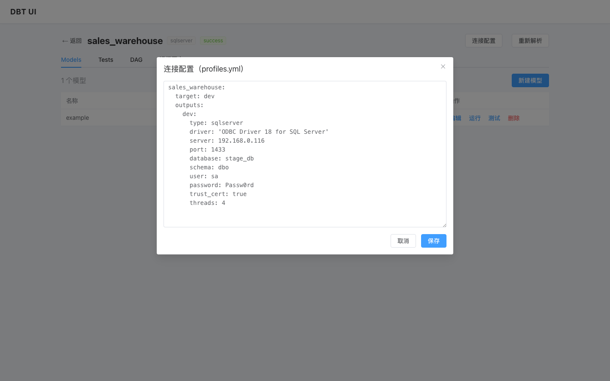

**SQL Server 三层分库配置说明：**
```yaml
sales_warehouse:
  target: dev
  outputs:
    dev:
      type: sqlserver
      driver: 'ODBC Driver 18 for SQL Server'
      server: 192.168.0.116
      port: 1433
      database: stage_db        # 主连接指向 stage_db
      schema: dbo
      user: sa
      password: Passw0rd
      trust_cert: true          # 信任自签名证书
      threads: 4
```

> 主连接的 `database` 指向 `stage_db`，但通过 dbt 的 `+database` 配置，模型可以写入 `core_db`、`mart_db` 等其他数据库。SQL Server 原生支持跨库查询（`database.schema.table`）。

### 1.7 重新解析

点击「重新解析」按钮，系统重新执行 `dbt parse` 并刷新所有元数据。

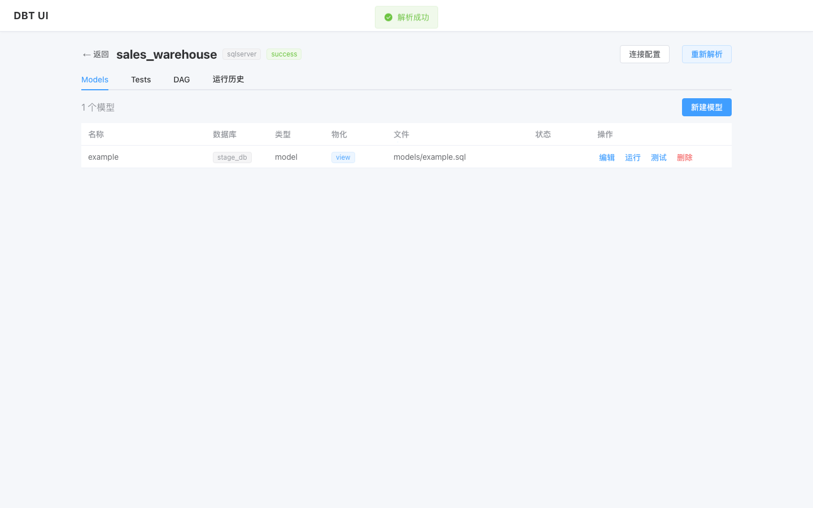

解析成功后，顶部状态标签会更新为 `success`。

### 1.8 分层配置入口

项目详情页顶部有一个「分层配置」按钮，用于管理 dbt 项目的分层结构（即 `dbt_project.yml` 中 `models` 下的目录级配置）。


点击后弹出分层配置列表弹窗，可以查看和管理所有分层。详细操作见 [第 2 章：分层配置管理](#第-2-章分层配置管理)。

---

## 第 2 章：分层配置管理

dbt 项目通过 `dbt_project.yml` 中的 `models` 配置，按目录划分不同的数据层（如 staging、core、marts），每层可以配置独立的数据库、schema、物化策略等。DBT UI 提供了可视化的分层配置管理界面，无需手动编辑 YAML 文件。

### 2.1 分层配置列表

点击项目详情页顶部的「分层配置」按钮，弹出分层配置列表弹窗。

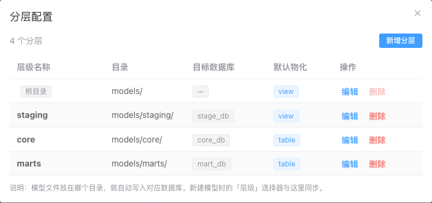

**列表列说明：**
- **层级名称**：对应 `models/` 下的子目录名（如 `staging`、`core`、`marts`），根目录显示为「Root」
- **目录**：完整的目录路径
- **目标数据库**：该层模型写入的目标数据库（`+database`）
- **默认物化**：该层模型的默认物化策略（`+materialized`），如 view、table、incremental
- **操作**：编辑、删除

> 「显示名称」（友好名称，如「Stage 层」「Core 层」）存储在 `+meta.display_name` 中，在**编辑弹窗**中可以查看和修改，列表页不展示。

> 根目录（`models/` 本身）是特殊分层，标记为「根目录」，不可删除、不可改名，用于配置根目录下模型的默认行为。

### 2.2 新建分层

点击分层列表弹窗右上角的「新建分层」按钮，弹出新建分层表单。

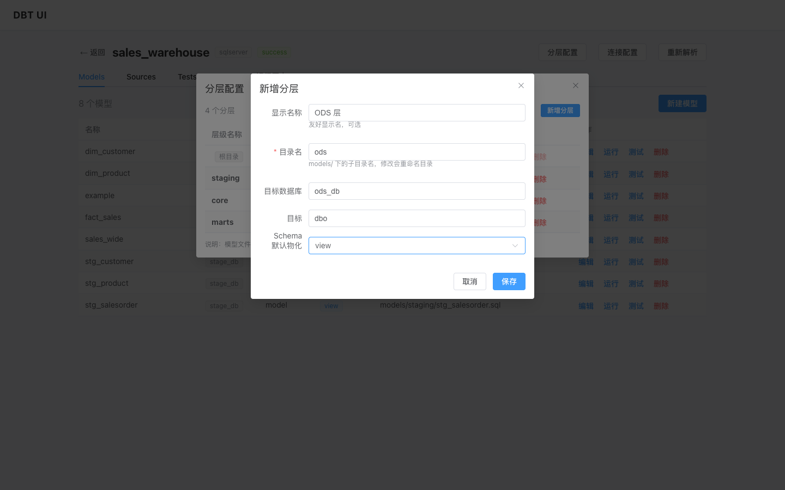

**表单字段说明：**
- **显示名称**：分层的友好显示名称（如「ODS 层」），可选
- **目录名**：`models/` 下的子目录名称，必填，仅允许字母、数字、下划线
- **数据库**：该层模型写入的目标数据库（`+database`）
- **Schema**：该层模型的默认 schema（`+schema`），可选
- **物化策略**：该层模型的默认物化方式（view / table / incremental / ephemeral）

填写完成后点击「确定」，系统将：
1. 在 `dbt_project.yml` 的 `models.<project_name>` 下添加对应目录的配置
2. 在 `models/` 下创建对应目录
3. 自动重新解析项目

### 2.3 编辑分层

点击分层列表中某行的「编辑」按钮，弹出编辑表单。

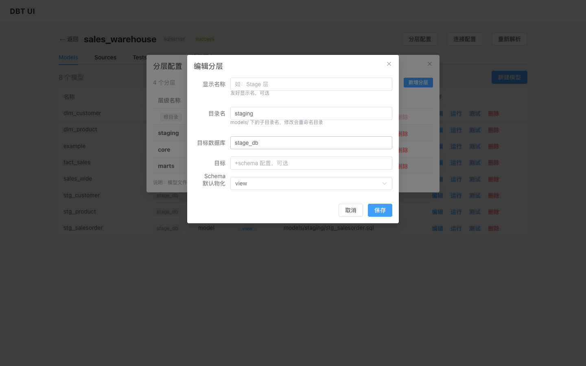

可以修改显示名称、数据库、schema、物化策略。如果修改了**目录名**，系统会：
1. 将 `models/` 下的原目录整体重命名为新目录名（目录下的所有模型文件一并迁移）
2. 更新 `dbt_project.yml` 中的配置键名
3. 自动重新解析项目

> **目录重命名说明**：系统直接重命名整个目录，如果新目录名与已有目录冲突，会报错提示。重命名操作会在后端日志中记录完整的源路径和目标路径，方便排查。

### 2.4 删除分层

点击分层列表中某行的「删除」按钮，确认后删除该分层配置。

> 删除分层仅删除 `dbt_project.yml` 中的配置，**不会删除磁盘上的目录和模型文件**，避免误删数据。删除后该目录下的模型将继承上层（根目录）的配置。

### 2.5 项目默认分层

新建 SQL Server 项目时，系统会自动创建以下三层分层配置：

| 显示名称 | 目录名 | 数据库 | 物化 | 说明 |
|----------|--------|--------|------|------|
| Stage 层 | `staging` | `stage_db` | table | 贴源加载层 |
| Core 层 | `core` | `core_db` | table | 维度建模核心层 |
| Mart 层 | `marts` | `mart_db` | table | 应用宽表层 |

这三层对应 SQL Server 三层分库架构，开箱即用。

---

## 第 3 章：配置源系统（Sources 可视化）

SQL Server 版本中，源数据存储在独立的 `sales_db` 数据库中。我们需要通过 dbt 的 **source** 机制来定义和引用源表。DBT UI 提供了完整的 Sources 可视化管理界面，无需手动编辑 YAML 文件。

### 3.1 什么是 source

在 dbt 中，`source` 是对源系统数据表的声明式定义。通过 Sources 管理界面，我们告诉 dbt：
- 源数据在哪个数据库（`sales_db`）
- 在哪个 schema（`dbo`）
- 有哪些表（customer / product / salesorder）

定义后，就可以在模型 SQL 中使用 `{{ source('sales_db', 'customer') }}` 来引用源表。

### 3.2 Sources 管理界面

在项目详情页切换到「Sources」标签页，进入 Source 管理界面。

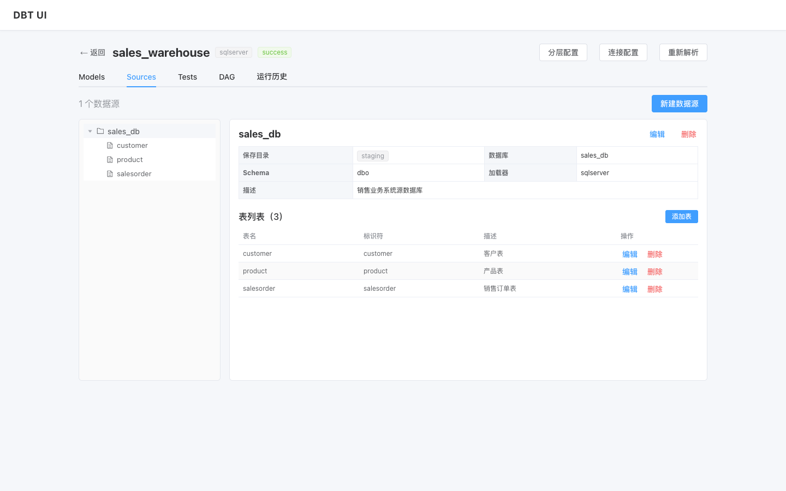

**界面布局：**
- **左侧**：目录树，按目录分组展示所有 source
- **右侧**：选中 source 的详情信息，包括基本信息和表列表
- **顶部**：「新建 Source」按钮

左侧目录树以 `models/` 下的子目录为分组，每个目录下可以存放多个 source 定义文件。

### 3.3 新建 Source

点击左上角「新建 Source」按钮，弹出新建 Source 对话框。

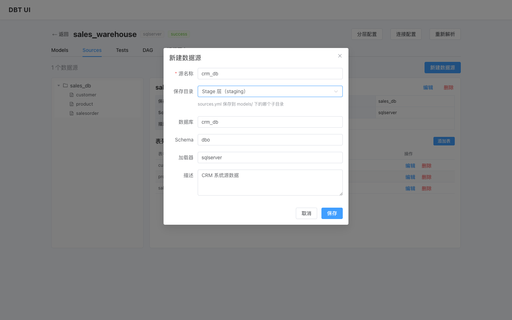

**表单字段说明：**
- **Source 名称**：source 的逻辑名称（在 `{{ source() }}` 中使用），如 `sales_db`
- **数据库**：物理数据库名（SQL Server 中的数据库名），如 `sales_db`
- **Schema**：schema 名称，SQL Server 中通常是 `dbo`
- **保存目录**：选择将 `sources.yml` 保存到哪个子目录下（如 `staging`、`core` 等）
- **描述**：source 的描述信息（可选）

填写完成后点击「确定」，系统将：
1. 在所选目录下创建或更新 `sources.yml` 文件
2. 自动重新解析项目
3. 新 source 出现在左侧目录树中

### 3.4 查看 Source 详情

在左侧目录树中点击某个 source，右侧显示其详细信息。

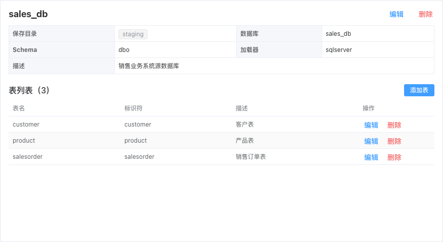

**详情页包含：**
- **基本信息**：名称、数据库、Schema、描述、保存目录
- **表列表**：该 source 下的所有源表，支持添加、编辑、删除
- **操作按钮**：编辑 Source、删除 Source

### 3.5 添加源表

在 Source 详情页的表列表区域，点击「添加表」按钮，弹出添加表对话框。

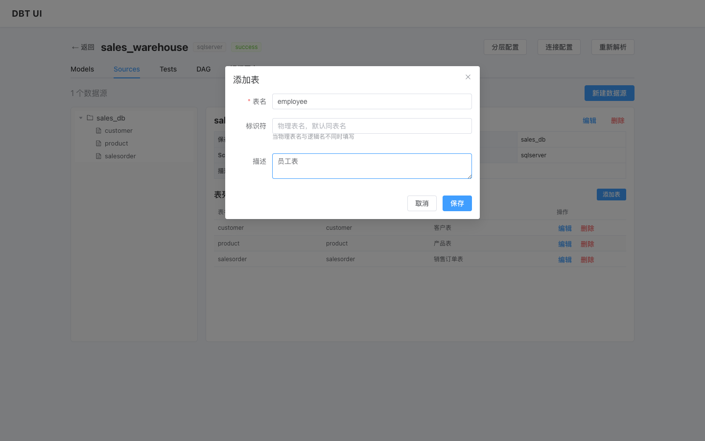

**表字段说明：**
- **表名**：源系统中的表名，如 `customer`
- **描述**：表的描述信息（可选）

我们为 `sales_db` source 添加三张表：`customer`、`product`、`salesorder`。

添加完成后，表列表如下：

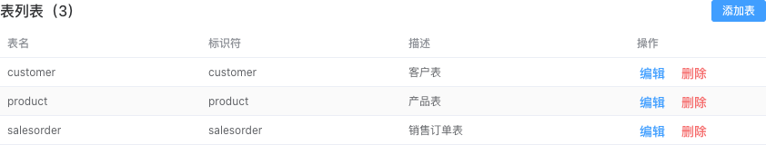

### 3.6 编辑和删除

- **编辑 Source**：点击详情页的「编辑」按钮，可修改名称、数据库、Schema、保存目录等。如果修改了保存目录，系统会将 source 定义移动到新目录下的 `sources.yml` 中。
- **删除 Source**：点击详情页的「删除」按钮，确认后删除该 source 及其所有表定义。如果目录下只剩这一个 source，空的 `sources.yml` 文件会被自动清理。
- **编辑表**：点击表列表中某行的「编辑」按钮，修改表名或描述。
- **删除表**：点击表列表中某行的「删除」按钮，删除该表定义。

### 3.7 解析后查看

Sources 配置完成后，系统会自动重新解析。解析完成后，在 Models 列表中可以看到源表（source 节点）。

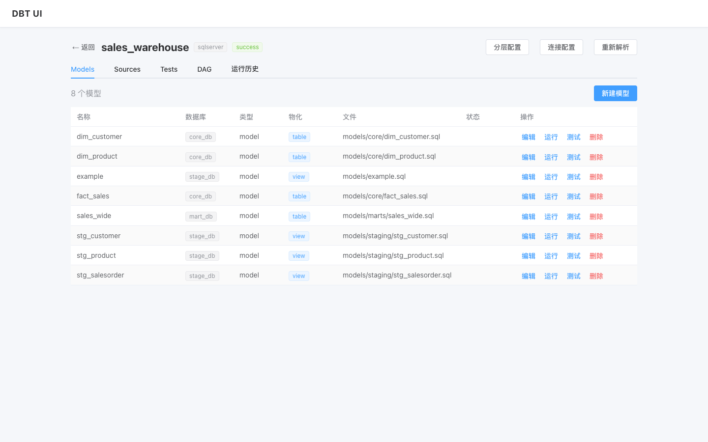

source 节点会显示在模型列表中，其「数据库」列显示为 `sales_db`，「类型」列显示为 `source`。

---

## 第 4 章：Stage 层 — 贴源加载（stage_db）

Stage 层是数据仓库的第一层，所有模型写入 `stage_db` 数据库。负责从源系统 1:1 加载数据，做字段命名规范化和基础清洗，默认以表（table）形式物化。

### 4.1 新建 Stage 模型

点击「新建模型」按钮，弹出创建对话框。


**新建模型弹窗包含：**
- **名称**：模型名称（不含 .sql 后缀）
- **层级**：选择模型所属的层级（对应不同的数据库）
  - Stage 层（staging）→ `stage_db`
  - Core 层（core）→ `core_db`
  - Mart 层（marts）→ `mart_db`
  - 根目录（models）→ 主数据库
- **SQL**：模型的 SQL 代码

### 4.2 编写 stg_customer

我们以 `stg_customer` 为例，创建 Stage 层的第一个模型：

1. **名称**：输入 `stg_customer`
2. **层级**：选择「Stage 层（staging）」— 对应 `stage_db` 数据库
3. **SQL**：编写从 source 加载客户数据的 SQL

```sql
SELECT
    customer_id,
    customer_name,
    gender,
    age,
    city,
    create_date
FROM {{ source('sales_db', 'customer') }}
```

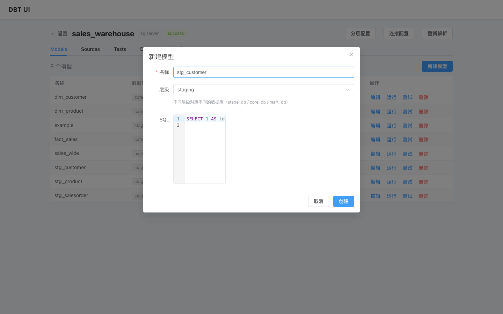

> 注意使用 `{{ source('sales_db', 'customer') }}` 引用源表，而不是 `{{ ref() }}`。
> `source()` 用于引用源系统表，`ref()` 用于引用 dbt 模型。

点击「创建」按钮，系统将：
1. 在 `models/staging/` 目录下创建 `stg_customer.sql`
2. 自动重新解析项目
3. 新模型出现在列表中，「数据库」列显示 `stage_db`

### 4.3 Stage 层完整模型

按照同样的方式，创建以下三个 Stage 层模型：

| 模型名 | 数据库 | 物化 | 说明 | 来源 |
|--------|--------|------|------|------|
| `stg_customer` | stage_db | table | 客户贴源表 | `{{ source('sales_db', 'customer') }}` |
| `stg_product` | stage_db | table | 商品贴源表 | `{{ source('sales_db', 'product') }}` |
| `stg_salesorder` | stage_db | table | 订单贴源表 | `{{ source('sales_db', 'salesorder') }}` |

**stg_product SQL：**
```sql
SELECT
    product_id,
    product_name,
    category,
    price,
    create_date
FROM {{ source('sales_db', 'product') }}
```

**stg_salesorder SQL：**
```sql
SELECT
    order_id,
    order_date,
    customer_id,
    product_id,
    quantity,
    unit_price,
    amount,
    status
FROM {{ source('sales_db', 'salesorder') }}
```

创建完成后，模型列表如下：


可以看到所有 `stg_` 开头的模型，「数据库」列都显示为 `stage_db`，「物化」列显示为 `table`。

### 4.4 运行 stg_customer

点击 `stg_customer` 行的「运行」按钮，弹出运行对话框。

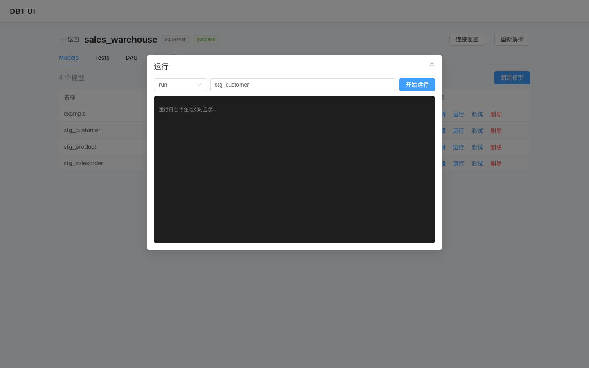

**运行对话框说明：**
- **运行类型**：`run`（运行模型）/ `test`（运行测试）/ `compile`（仅编译）/ `build`（构建全部）
- **选择表达式**：dbt `--select` 参数，支持 `model_name`、`model_name+`、`+model_name` 等
- 点击「开始运行」启动执行

### 4.5 运行中 — 实时日志

点击「开始运行」后，系统通过 WebSocket 实时推送 dbt 运行日志。

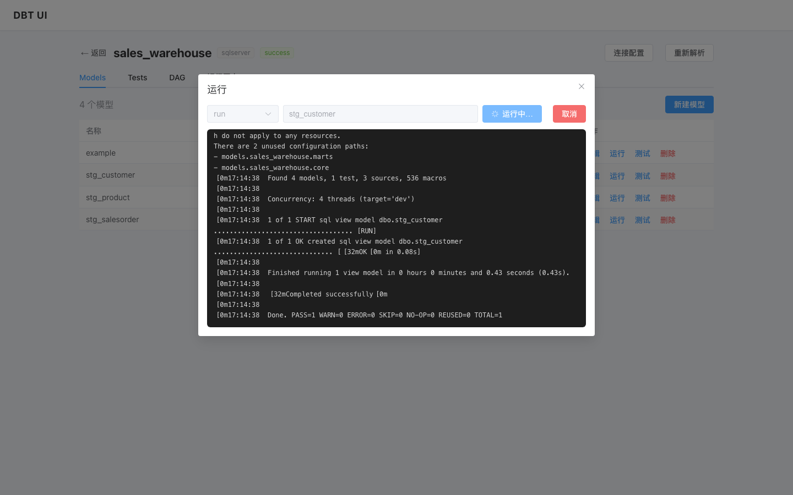

**实时日志特性：**
- 日志区暗色背景，逐行显示 dbt 输出
- 运行中的节点在 DAG 图中以蓝色呼吸动画高亮
- 节点状态变化（running → success/error）实时推送

### 4.6 运行完成

运行完成后，日志底部显示结果。

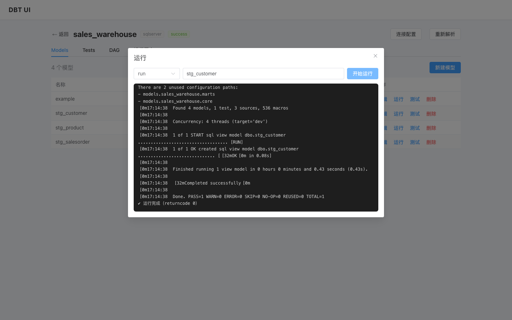

- `✔ 运行完成（returncode 0）`：运行成功
- `✘ 运行失败（returncode N）`：运行失败，查看日志排查原因

运行成功后，`stage_db` 数据库中会创建对应的表。

---

## 第 5 章：Core 层 — 维度建模（core_db）

Core 层采用维度建模，将数据组织为维度表（dimension）和事实表（fact），所有模型写入 `core_db` 数据库，默认以表（table）形式物化。

### 5.1 Core 层模型清单

| 模型名 | 数据库 | 类型 | 物化 | 说明 | 上游依赖 |
|--------|--------|------|------|------|----------|
| `dim_customer` | core_db | 维度表 | table | 客户维度 | `stg_customer`（stage_db） |
| `dim_product` | core_db | 维度表 | table | 商品维度 | `stg_product`（stage_db） |
| `fact_sales` | core_db | 事实表 | table | 销售事实（已完成订单） | `stg_salesorder`（stage_db） |

创建完成后，模型列表如下：


可以看到 `dim_` 和 `fact_` 开头的模型，「数据库」列都显示为 `core_db`。

> dbt 自动处理跨数据库依赖：`dim_customer` 在 `core_db` 中，但它引用的 `stg_customer` 在 `stage_db` 中，dbt 会通过 SQL Server 的跨库查询能力自动处理。

**dim_customer SQL：**
```sql
SELECT
    customer_id,
    customer_name,
    gender,
    age,
    city,
    create_date
FROM {{ ref('stg_customer') }}
```

**dim_product SQL：**
```sql
SELECT
    product_id,
    product_name,
    category,
    price,
    create_date
FROM {{ ref('stg_product') }}
```

### 5.2 编辑 fact_sales

点击 `fact_sales` 行的「编辑」按钮，查看或修改事实表 SQL。

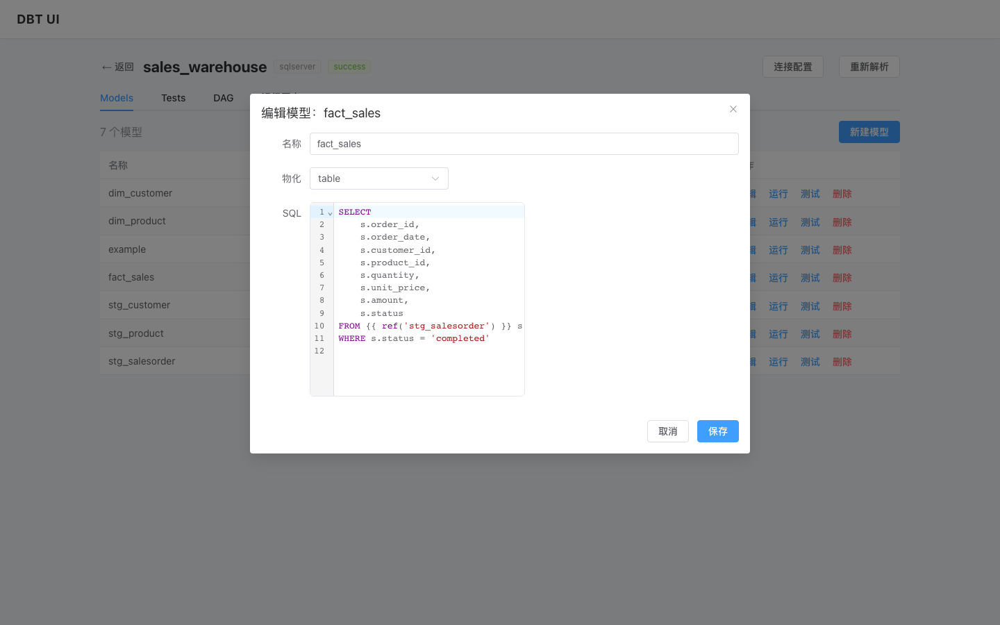

**fact_sales SQL：**
```sql
SELECT
    s.order_id,
    s.order_date,
    s.customer_id,
    s.product_id,
    s.quantity,
    s.unit_price,
    s.amount,
    s.status
FROM {{ ref('stg_salesorder') }} s
WHERE s.status = 'completed'
```

这里我们只取 `status = 'completed'` 的订单作为销售事实。

**编辑弹窗功能：**
- 修改模型名称
- 修改 SQL 内容
- 修改物化策略（view / table / incremental / ephemeral）

### 5.3 运行 fact_sales

点击 `fact_sales` 行的「运行」按钮，弹出运行对话框。

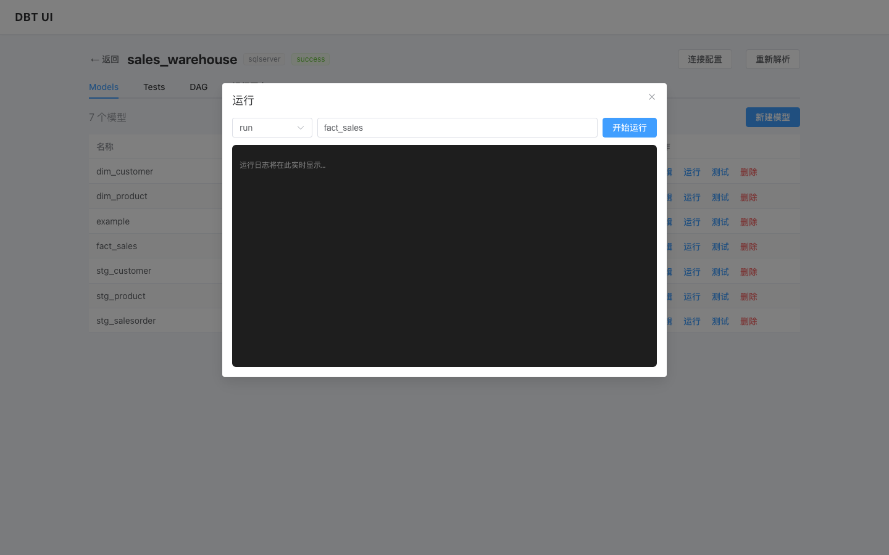

运行 `fact_sales` 时，dbt 会自动按依赖顺序运行其上游模型（包括 `stage_db` 中的 `stg_salesorder`）。

### 5.4 运行中

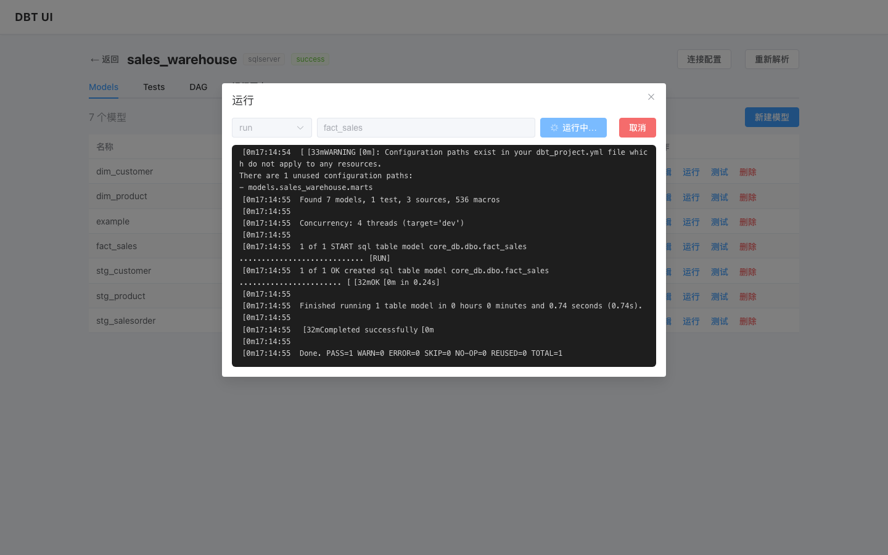

### 5.5 运行完成

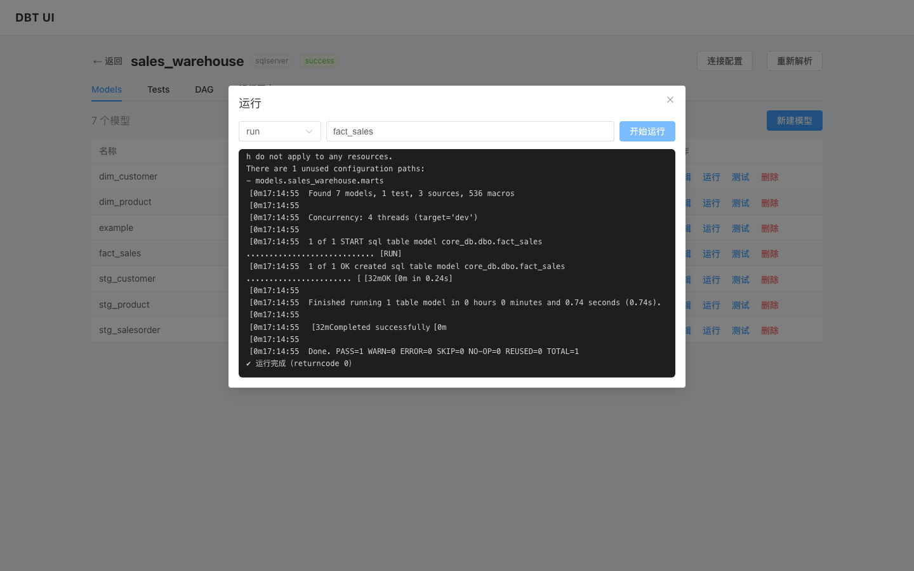

运行成功后，`core_db` 数据库中会创建对应的维度表和事实表。

---

## 第 6 章：Mart 层 — 应用宽表（mart_db）

Mart 层面向具体业务应用，通常构建大宽表，直接供报表或数据分析使用，所有模型写入 `mart_db` 数据库，默认以表（table）形式物化。

### 6.1 Mart 层模型

| 模型名 | 数据库 | 物化 | 说明 | 上游依赖 |
|--------|--------|------|------|----------|
| `sales_wide` | mart_db | table | 销售宽表 | `fact_sales` + `dim_customer` + `dim_product` |

创建完成后，模型列表如下：


`sales_wide` 模型的「数据库」列显示为 `mart_db`。

**sales_wide SQL：**
```sql
SELECT
    f.order_id,
    f.order_date,
    f.customer_id,
    c.customer_name,
    c.gender,
    c.age,
    c.city,
    f.product_id,
    p.product_name,
    p.category,
    p.price,
    f.quantity,
    f.unit_price,
    f.amount,
    f.status
FROM {{ ref('fact_sales') }} f
LEFT JOIN {{ ref('dim_customer') }} c ON f.customer_id = c.customer_id
LEFT JOIN {{ ref('dim_product') }} p ON f.product_id = p.product_id
```

### 6.2 数据测试

切换到 Tests 标签页，管理数据质量测试。

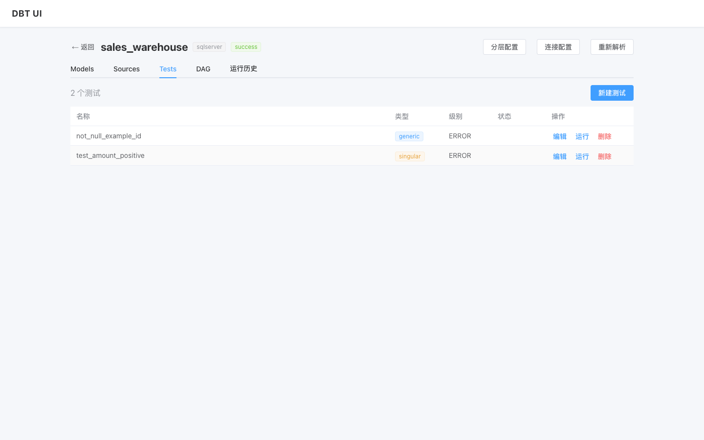

**测试类型：**
- **generic**：通用测试（如 unique、not_null、accepted_values 等，在 schema.yml 中定义）
- **singular**：自定义测试，用 SQL 编写（在 `tests/` 目录下）

### 6.3 新建测试

点击「新建测试」按钮，弹出创建对话框。


### 6.4 编写测试 SQL

我们创建一个测试，验证销售金额必须为正数：

- **名称**：`test_amount_positive`
- **SQL**：
```sql
SELECT *
FROM {{ ref('sales_wide') }}
WHERE amount <= 0
```

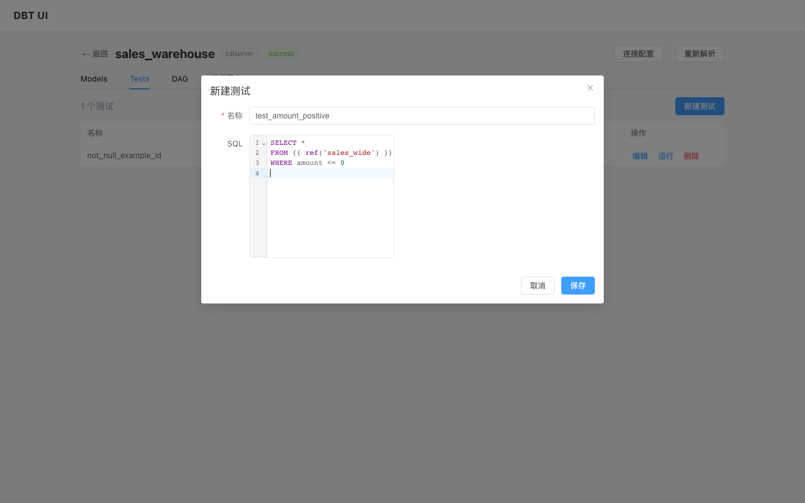

> 测试的逻辑是：如果 SQL 返回任何行，则测试失败（说明存在异常数据）。
> 即使测试在 `tests/` 目录下，它也能跨库访问 `mart_db` 中的 `sales_wide` 表。

点击「保存」按钮，系统将：
1. 在 `tests/` 目录下创建 `test_amount_positive.sql`
2. 自动重新解析项目
3. 测试出现在列表中

### 6.5 测试列表

创建完成后，Tests 标签页如下：

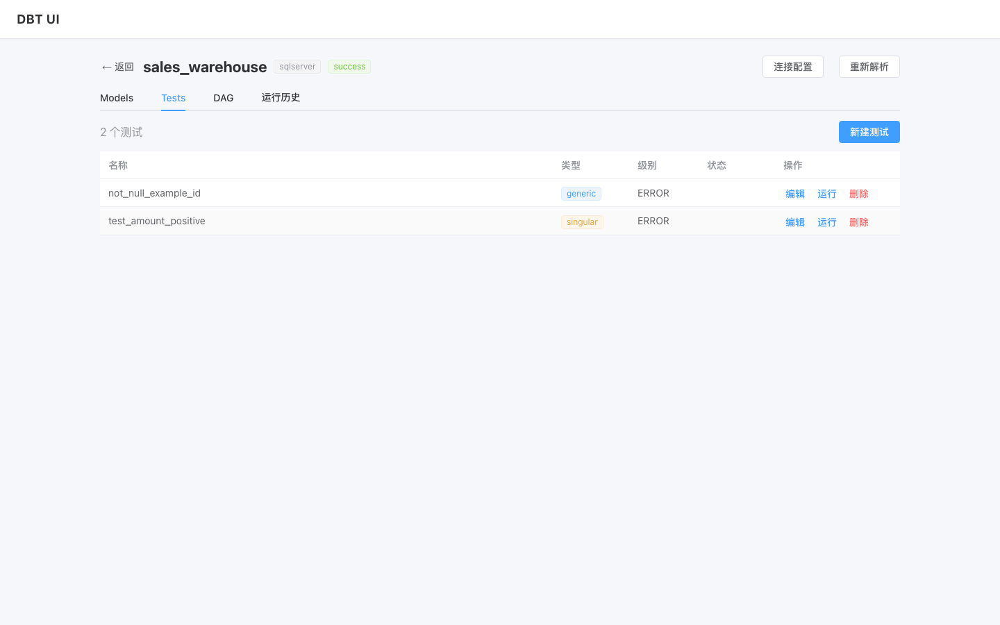

点击测试行的「运行」按钮可执行测试，查看是否通过。

---

## 第 7 章：Macro 编写与复用

dbt 的 **Macro** 是用 Jinja 编写的可复用 SQL 片段，类似于编程语言中的函数。通过 Macro 可以将重复的 SQL 逻辑抽象出来，在多个模型中复用，提高代码可维护性。DBT UI 提供了可视化的 Macro 管理界面，支持创建、编辑、删除 Macro，以及子目录分类。

### 7.1 什么是 Macro

Macro 是 dbt 中最强大的代码复用机制之一，常见使用场景：
- **通用计算逻辑**：如金额单位转换、日期格式化、安全除法等
- **自定义物化策略**：封装复杂的建表/插入逻辑
- **跨模型复用**：多个模型共享同一段 SQL 逻辑
- **参数化**：通过参数控制生成不同的 SQL

Macro 存放在 `macros/` 目录下，文件扩展名为 `.sql`，使用 `` 和 `` 包裹。

### 7.2 Macros 管理界面

在项目详情页切换到「Macros」标签页，进入 Macro 管理界面。

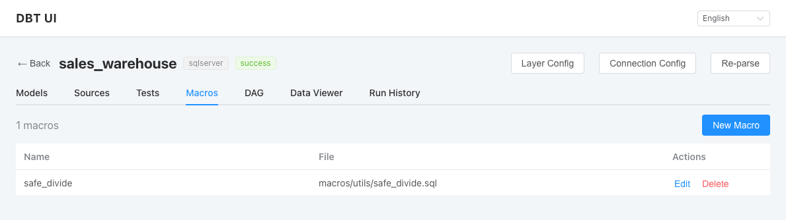

**界面说明：**
- **列表**：展示项目中所有自定义 Macro，包含名称、文件路径
- **新建 Macro**：点击左上角按钮创建新的 Macro
- **编辑**：修改 Macro 的名称和 SQL/Jinja 代码
- **删除**：删除指定的 Macro

> 注意：列表中只显示**当前项目自定义**的 Macro，dbt 内置 Macro 和第三方包的 Macro 不会显示在这里。

### 7.3 新建 Macro

点击「新建 Macro」按钮，弹出创建对话框。


**表单字段说明：**
- **名称**：Macro 的名称（不含 `.sql` 后缀），在模型中通过 `{{ macro_name() }}` 调用
- **目录**：`macros/` 下的子目录（可选），用于分类管理，如 `utils`、`audit`、`helpers`
- **SQL / Jinja**：Macro 的代码，使用 `` 语法

填写完成后点击「创建」，系统将：
1. 在 `macros/` 目录（或指定子目录）下创建 `.sql` 文件
2. 自动重新解析项目
3. 新 Macro 出现在列表中

### 7.4 示例：安全除法 Macro

我们以一个实用的「安全除法」Macro 为例，演示 Macro 的编写和使用。

**场景**：在计算单价（金额 ÷ 数量）时，如果数量为 0 或 NULL，直接相除会导致 SQL 报错。我们用 Macro 封装安全除法逻辑。

**Macro 代码：**
```sql

  {#- 安全除法：分母为零或为空时返回默认值，避免 SQL 报错 -#}
  CASE
    WHEN {{ denominator }} = 0 OR {{ denominator }} IS NULL
    THEN {{ default_value }}
    ELSE {{ numerator }} / {{ denominator }}
  END

```

**参数说明：**
- `numerator`：分子（被除数）
- `denominator`：分母（除数）
- `default_value`：分母为零时的默认返回值，默认为 0

### 7.5 在模型中使用 Macro

定义好 Macro 后，就可以在任何模型的 SQL 中直接调用。我们在 `sales_wide` 宽表中使用 `safe_divide` 计算实际单价：

```sql
SELECT
    f.order_id,
    f.order_date,
    f.customer_id,
    c.customer_name,
    c.gender,
    c.age,
    c.city,
    f.product_id,
    p.product_name,
    p.category,
    p.price,
    f.quantity,
    f.unit_price,
    f.amount,
    f.status,
    -- 使用 safe_divide 宏计算实际单价，避免数量为 0 时报错
    {{ safe_divide('f.amount', 'f.quantity') }} AS actual_unit_price
FROM {{ ref('fact_sales') }} f
LEFT JOIN {{ ref('dim_customer') }} c ON f.customer_id = c.customer_id
LEFT JOIN {{ ref('dim_product') }} p ON f.product_id = p.product_id
```

**调用方式**：`{{ safe_divide('f.amount', 'f.quantity') }}`
- 第一个参数是分子（金额字段）
- 第二个参数是分母（数量字段）
- 省略第三个参数时，默认值为 0

> 注意：参数需要用**字符串**形式传入（加引号），因为 dbt 会将它们作为 Jinja 变量替换到 Macro 的 SQL 模板中。

### 7.6 编辑 Macro

点击 Macro 行的「编辑」按钮，可以查看和修改 Macro 的代码。

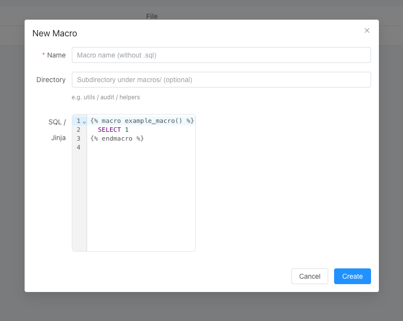

**编辑弹窗功能：**
- 修改 Macro 名称（重命名文件）
- 修改 SQL / Jinja 代码
- 保存后自动重新解析项目

> 修改 Macro 后，所有引用该 Macro 的模型在下次运行时会自动使用最新版本，无需手动修改模型文件。

---

## 第 8 章：Snapshot 增量抓取

dbt 的 **Snapshot（快照）** 用于跟踪维度表数据随时间的变化，是实现 SCD2（Slowly Changing Dimension Type 2）历史追溯的核心机制。当源表中的某行数据被修改或删除时，快照会在 `target_schema` 中保留旧版本记录并插入新版本，从而支持基于时间点的数据回溯与对比分析。

DBT UI 提供了可视化的 Snapshot 管理界面，支持创建、编辑、删除、运行快照，文件存放在项目根目录的 `snapshots/` 下，扩展名为 `.sql`。

### 8.1 什么是 Snapshot

Snapshot 的常见使用场景：

- **历史追溯**：记录客户信息（姓名、地址、等级）的变更历史
- **审计需求**：保留订单状态变更的全过程（待支付 → 已支付 → 已发货 → 已签收）
- **维度变化分析**：统计某商品在调价前后的销量差异
- **数据回滚查询**：查询「截至某日」的数据快照状态

**核心配置项：**

| 配置项 | 说明 | 示例值 |
|--------|------|--------|
| `target_schema` | 快照结果存放的 Schema | `snapshots` |
| `unique_key` | 唯一标识源表行的列 | `id` |
| `strategy` | 变更检测策略 | `timestamp` 或 `check` |
| `updated_at` | 时间戳策略下用于判断变更时间的列 | `updated_at` |
| `check_cols` | 检查策略下要监控的列 | `['status', 'amount']` |

> **两种策略对比：**
> - **`timestamp`**：依赖源表的 `updated_at` 列，性能高，要求源表维护变更时间戳
> - **`check`**：对比指定列的值是否变化，适用于源表无 `updated_at` 列的场景

### 8.2 Snapshots 管理界面

在项目详情页切换到「Snapshots」标签页，进入快照管理界面。

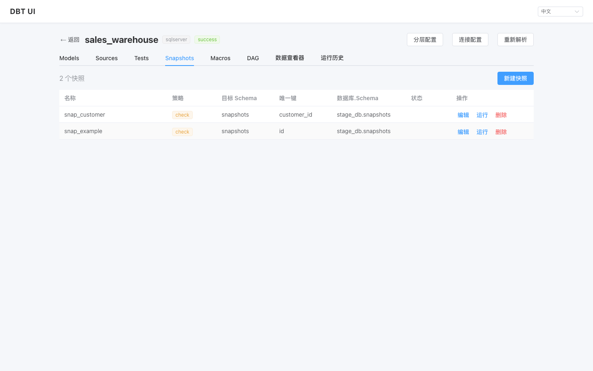

**界面说明：**
- **列表**：展示项目中所有快照，包含名称、策略、目标 Schema、唯一键、数据库.Schema、运行状态
- **新建快照**：点击左上角按钮创建新的快照
- **运行**：执行 `dbt snapshot`，对单条快照抓取增量
- **编辑**：修改快照名称和 SQL 代码
- **删除**：删除指定快照（同时移除磁盘文件）

> 注意：列表中只显示已解析成功的快照；若快照 SQL 存在语法错误，需修正后重新解析才会出现。

### 8.3 新建 Snapshot

点击「新建快照」按钮，弹出创建对话框。

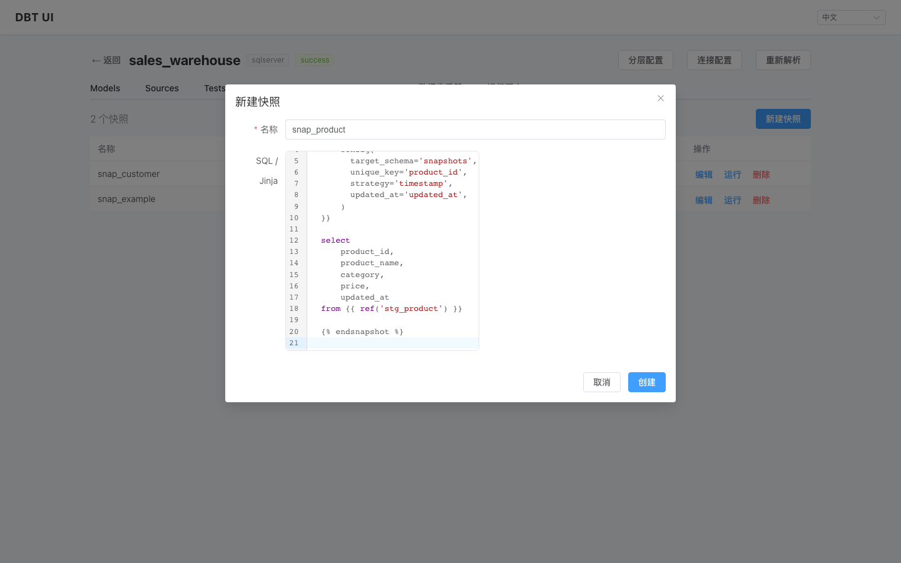

**表单字段说明：**
- **名称**：快照的名称（不含 `.sql` 后缀），对应 SQL 中 `` 的标识
- **SQL / Jinja**：快照的完整代码，使用 `` 和 `` 包裹

系统会预填一个 `timestamp` 策略的模板，用户在此基础上修改即可。填写完成后点击「创建」，系统将：

1. 在 `snapshots/` 目录下创建 `<名称>.sql` 文件
2. 自动重新解析项目（refresh manifest）
3. 新快照出现在列表中

### 8.4 示例：客户信息快照

我们以跟踪客户等级变化为例，演示 Snapshot 的完整用法。

**场景**：客户表 `stg_customer` 中的 `customer_level` 会随消费累计升级，我们希望保留每次等级变化的记录，用于分析升级前后的消费行为差异。

**Snapshot 代码：**
```sql


{{
    config(
      target_schema='snapshots',
      unique_key='customer_id',
      strategy='check',
      check_cols=['customer_level', 'phone'],
    )
}}

select
    customer_id,
    customer_name,
    customer_level,
    phone,
    region
from {{ ref('stg_customer') }}


```

**参数说明：**
- `target_schema='snapshots'`：快照结果写入独立的 `snapshots` schema，与业务表隔离
- `unique_key='customer_id'`：以客户 ID 作为唯一标识，源表同一客户多次变更只产生一条主记录
- `strategy='check'`：因源表无可靠的 `updated_at` 列，改用列值对比
- `check_cols=['customer_level', 'phone']`：监控等级和电话两个字段，任一变化即抓取新版本

### 8.5 运行 Snapshot

在快照列表中点击对应行的「运行」按钮，系统弹出运行对话框：

- **运行范围**：自动选中当前快照名
- **运行类型**：`snapshot`（对应底层 `dbt snapshot` 命令）

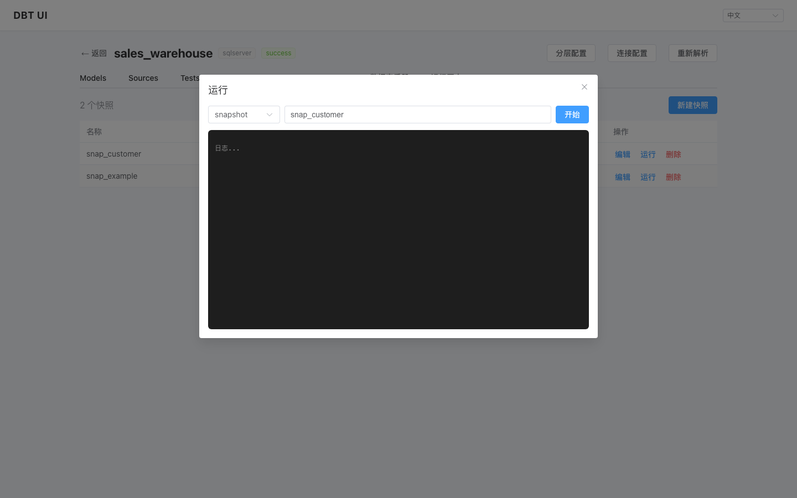

点击「执行」后，系统将通过 WebSocket 实时推送运行日志，运行状态在列表中更新：

- **运行中**：节点显示蓝色呼吸动画
- **运行成功**：状态变为 `success`（绿色）
- **运行失败**：状态变为 `failed`（红色），可在运行历史查看错误日志

### 8.6 快照结果结构

首次运行后，dbt 会在 `snapshots` schema 下生成与快照同名的表，结构为源表字段加上以下 4 个审计列：

| 列名 | 说明 |
|------|------|
| `dbt_scd_id` | 快照记录唯一 ID（哈希生成） |
| `dbt_updated_at` | 当前版本生效时间 |
| `dbt_valid_from` | 当前版本起始时间 |
| `dbt_valid_to` | 当前版本失效时间（NULL 表示最新版本） |

查询某客户的历史等级变化：
```sql
SELECT customer_id, customer_level,
       dbt_valid_from, dbt_valid_to
FROM snapshots.snap_customer
WHERE customer_id = 1001
ORDER BY dbt_valid_from;
```

### 8.7 编辑与删除

**编辑快照：**
- 点击列表行的「编辑」按钮，弹窗预填当前 SQL 内容
- 修改名称时，系统会自动同步替换 SQL 中 `` 为 ``，并重命名磁盘文件
- 保存后自动重新解析

**删除快照：**
- 点击「删除」按钮，二次确认后执行
- 删除会移除 `snapshots/` 下对应的 `.sql` 文件并重新解析
- **注意**：已生成的快照结果表不会被删除，需手动到目标库清理

---

## 第 9 章：DAG 血缘图

DAG（有向无环图）以可视化方式展示模型间的依赖关系，包括跨数据库的依赖和 source 节点。

### 9.1 DAG 全景

切换到 DAG 标签，查看完整的数据流向图。

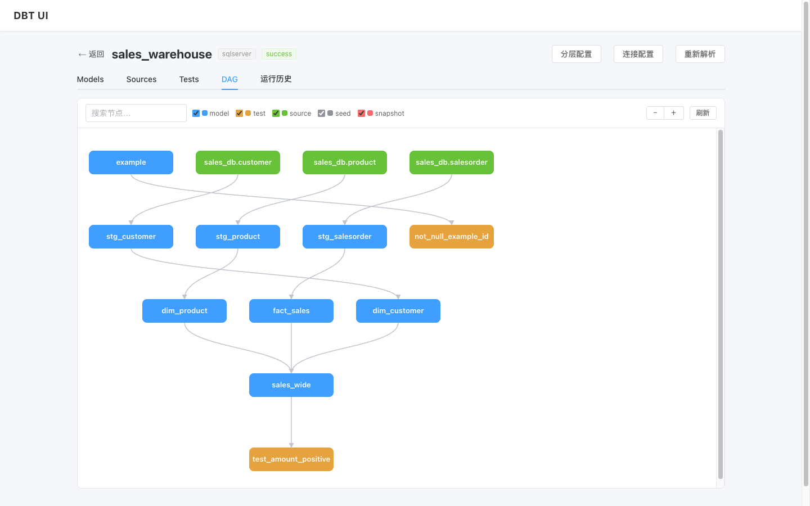

**DAG 图说明：**
- 每个节点代表一个模型、测试或 source
- 箭头表示数据流向（上游 → 下游）
- 不同类型的节点用不同颜色区分：
  - 🔵 蓝色：model（模型）
  - 🟢 绿色：source（源表）
  - 🟡 橙色：test（测试）
- 运行中的节点以蓝色呼吸动画高亮
- 跨数据库的依赖关系同样会显示（如 sales_db → stage_db → core_db → mart_db）
- 顶部工具栏支持搜索、按类型过滤、缩放、刷新

### 9.2 fact_sales 血缘

点击 `fact_sales` 节点，系统高亮其所有上游和下游血缘链路。

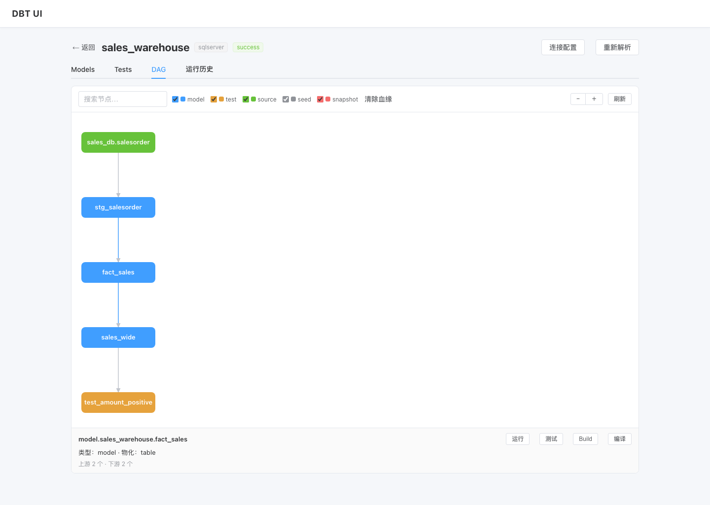

**交互说明：**
- 点击节点：选中并高亮血缘链路（上游 + 下游）
- 再次点击：取消选中
- 非血缘节点会变暗，突出显示依赖关系

从图中可以看到 `fact_sales`（core_db）的上游是 `stg_salesorder`（stage_db）和 source 表 `sales_db.salesorder`，下游是 `sales_wide`（mart_db）。

### 9.3 sales_wide 血缘

点击 `sales_wide` 节点，查看宽表的完整血缘链路。

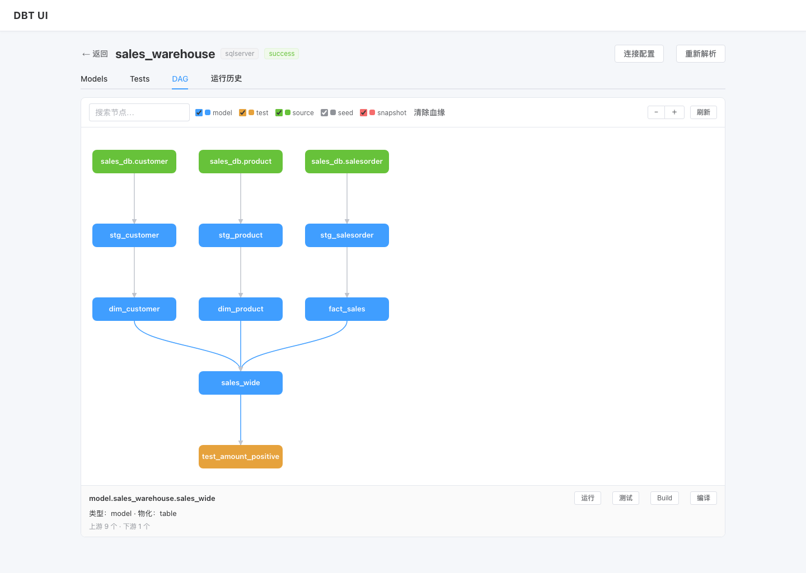

从图中可以清晰看到完整的四层数据流向：
- **最上游（源系统 sales_db）**：`sales_db.customer`、`sales_db.product`、`sales_db.salesorder`
- **Stage 层（stage_db）**：`stg_customer`、`stg_product`、`stg_salesorder`
- **Core 层（core_db）**：`dim_customer`、`dim_product`、`fact_sales`
- **最下游（mart_db）**：`sales_wide`

---

## 第 10 章：数据查看器（Data Viewer）

数据查看器提供了直接浏览数据库中表和视图的能力，可以查看表结构（DDL）和数据预览，方便在开发过程中验证数据是否正确写入。

> 注意：数据查看器目前仅支持 **SQL Server** 适配器。

### 10.1 界面概览

在项目详情页切换到「数据查看器」标签页，进入数据查看器界面。


**界面布局：**
- **左侧**：数据库树，按「数据库 → 表/视图」层级展示
- **右侧**：选中表的详情，包含 DDL 创建脚本和数据预览
- **顶部**：「刷新」按钮，重新加载数据库列表

### 10.2 浏览数据库和表

左侧数据库树展示了当前项目可访问的所有数据库。点击数据库名称展开，查看该数据库下的所有表和视图。

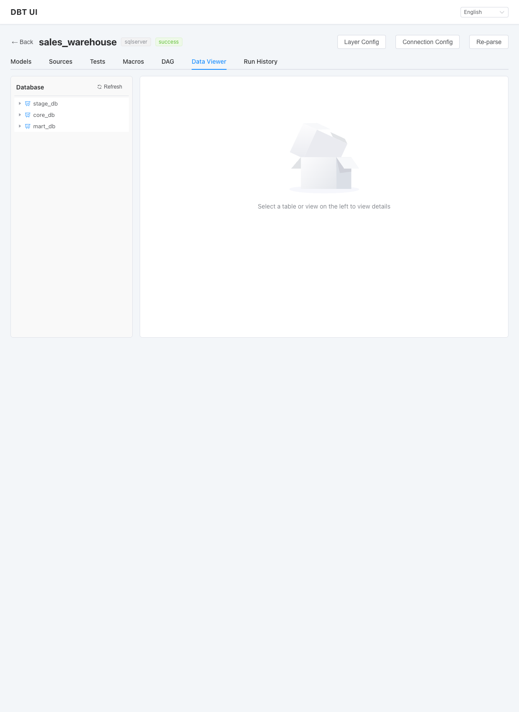

**树节点说明：**
- **数据库节点**：显示数据库名称，点击展开/折叠
- **表节点**：显示表名，图标为表（Table）
- **视图节点**：显示视图名，图标为视图（View）

### 10.3 查看表详情

在左侧树中点击某张表，右侧显示该表的详细信息。


**详情页包含两部分：**

**1. DDL 创建脚本**
- 显示该表的完整 CREATE TABLE 语句
- 包含字段名、数据类型、长度、是否为空、主键等定义
- 可用于了解表结构

**2. 数据预览**
- 显示表中的前 1000 行数据
- 以表格形式展示，支持滚动浏览
- 用于快速验证数据是否正确写入

### 10.4 刷新数据

点击左上角「刷新」按钮，重新从数据库加载最新的表列表和数据。

> 提示：运行模型后，如果表结构或数据发生了变化，点击「刷新」按钮即可看到最新结果。

---

## 第 11 章：运行历史与日志

### 11.1 运行历史列表

切换到「运行历史」标签，查看所有运行记录。

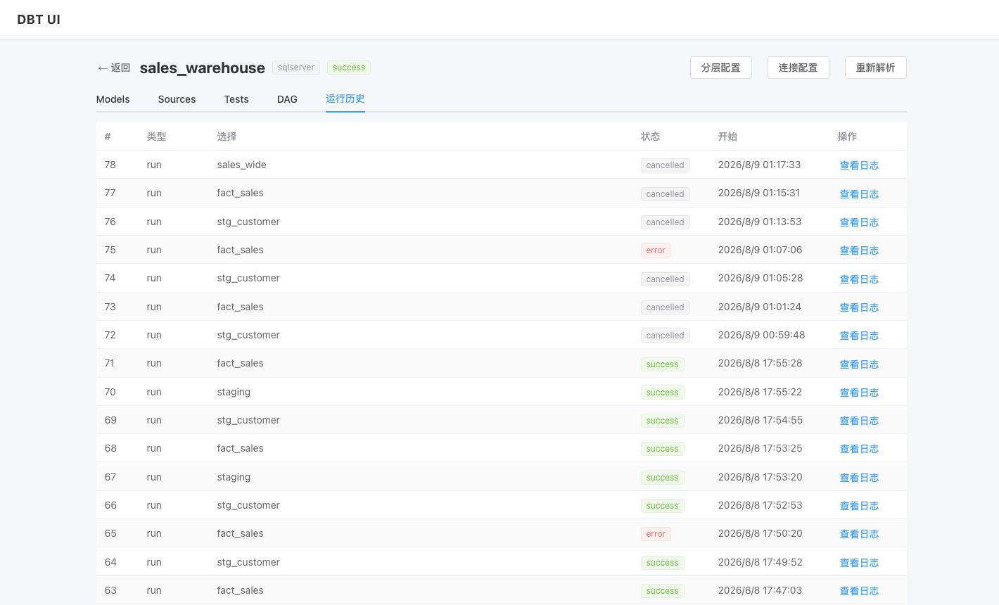

**表格列说明：**
- **#**：运行编号
- **类型**：运行类型（run / test / compile / build / snapshot）
- **选择**：`--select` 表达式
- **状态**：success / error / cancelled / running
- **开始**：运行开始时间
- **操作**：查看日志

### 11.2 查看运行日志

点击「查看日志」按钮，弹出日志详情弹窗。

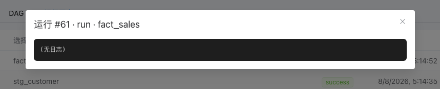

**日志弹窗说明：**
- 标题显示运行编号、类型和选择表达式
- 内容区显示完整运行日志
- 可用于排查运行失败原因

### 11.3 返回项目列表

点击左上角「← 返回」按钮，返回项目列表页。

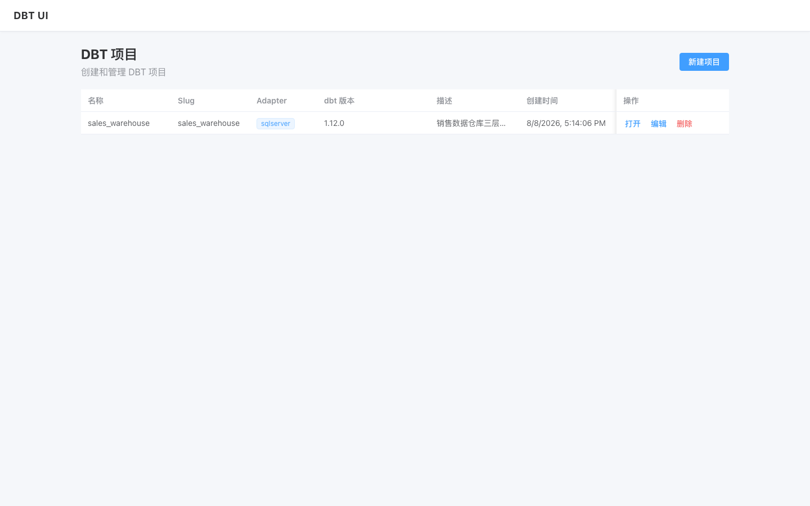

---

## 附录：模型清单、架构图、常见问题

### 完整模型清单

| 层级 | 数据库 | 模型名 | 类型 | 物化 | 说明 |
|------|--------|--------|------|------|------|
| Source | sales_db | `sales_db.customer` | source | — | 源系统客户表 |
| Source | sales_db | `sales_db.product` | source | — | 源系统商品表 |
| Source | sales_db | `sales_db.salesorder` | source | — | 源系统订单表 |
| Stage | stage_db | `stg_customer` | model | table | 客户贴源表 |
| Stage | stage_db | `stg_product` | model | table | 商品贴源表 |
| Stage | stage_db | `stg_salesorder` | model | table | 订单贴源表 |
| Core | core_db | `dim_customer` | model | table | 客户维度表 |
| Core | core_db | `dim_product` | model | table | 商品维度表 |
| Core | core_db | `fact_sales` | model | table | 销售事实表（已完成订单） |
| Mart | mart_db | `sales_wide` | model | table | 销售宽表 |

### 测试清单

| 测试名 | 类型 | 目标表 | 说明 |
|--------|------|--------|------|
| `test_amount_positive` | singular | mart_db.sales_wide | 验证销售金额为正数 |

### Macro 清单

| Macro 名 | 目录 | 参数 | 说明 |
|----------|------|------|------|
| `safe_divide` | macros/utils/ | numerator, denominator, default_value=0 | 安全除法，分母为零或 NULL 时返回默认值 |

### 数据流向图

```
sales_db (源系统)
┌──────────────────┐
│ sales_db.customer│────┐
├──────────────────┤    │
│ sales_db.product │────│────┐
├──────────────────┤    │    │
│sales_db.salesorder│───│────│────┐
└──────────────────┘    │    │    │
          ↓ source()    │    │    │
stage_db                │    │    │
┌──────────────┐        │    │    │
│ stg_customer │←───────┘    │    │
├──────────────┤             │    │
│ stg_product  │←────────────┘    │
├──────────────┤                  │
│stg_salesorder│←─────────────────┘
└──────────────┘
          ↓ ref()
core_db
┌──────────────┐
│ dim_customer │←──────┐
├──────────────┤       │
│ dim_product  │←──────│──────┐
├──────────────┤       │      │
│ fact_sales   │←──────┘──────┘
└──────────────┘
          ↓ ref()
mart_db
┌──────────────────┐
│   sales_wide     │
└──────────────────┘
```

### profiles.yml 详解

```yaml
sales_warehouse:
  target: dev
  outputs:
    dev:
      type: sqlserver
      driver: 'ODBC Driver 18 for SQL Server'   # ODBC 驱动名称
      server: 192.168.0.116                     # SQL Server 服务器地址
      port: 1433                                 # 端口（默认 1433）
      database: stage_db                         # 主连接数据库
      schema: dbo                                # 默认 schema
      user: sa                                   # 用户名
      password: Passw0rd                         # 密码
      trust_cert: true                           # 信任自签名证书（开发环境用）
      threads: 4                                 # 并发线程数
```

**关键参数说明：**
- `driver`：ODBC 驱动名称，必须与系统安装的驱动版本一致
- `trust_cert: true`：开发环境常用，跳过 SSL 证书验证；生产环境建议配置正式证书
- `database`：主连接数据库，但模型可以通过 `+database` 配置写入其他数据库

### dbt_project.yml 分层配置

项目的 `dbt_project.yml` 中按目录配置了不同的目标数据库：

```yaml
models:
  sales_warehouse:
    # Stage 层 — 贴源加载，写入 stage_db
    staging:
      +database: stage_db
      +materialized: table
    # Core 层 — 维度建模，写入 core_db
    core:
      +database: core_db
      +materialized: table
    # Mart 层 — 应用宽表，写入 mart_db
    marts:
      +database: mart_db
      +materialized: table
```

**规则：**
- `models/staging/` 目录下的模型 → `stage_db` 数据库
- `models/core/` 目录下的模型 → `core_db` 数据库
- `models/marts/` 目录下的模型 → `mart_db` 数据库
- `models/` 根目录下的模型 → 主数据库（profiles.yml 中配置的 database）
