# DBT UI User Guide — SQL Server Three-Layer Database Edition

> This guide uses a complete sales data warehouse project as an example to demonstrate all operations of DBT UI from scratch.
> Database: SQL Server, using a **stage_db / core_db / mart_db** three-layer physical database architecture.
> All screenshots are saved in the `doc/userguide_en/` directory.

---

## Case Background

Suppose we have a source business system running on **SQL Server** with a database named `sales_db` containing three business tables:

| Source Table | Description | Main Fields | Row Count |
|--------------|-------------|-------------|-----------|
| `customer` | Customer table | customer_id, customer_name, gender, age, city, create_date | 8 rows |
| `product` | Product table | product_id, product_name, category, price, create_date | 8 rows |
| `salesorder` | Order table | order_id, order_date, customer_id, product_id, quantity, unit_price, amount, status | 18 rows |

The `status` field values: `completed` / `processing` / `cancelled`.

We need to build a **three-layer** data warehouse, with each layer corresponding to an independent physical database, all deployed on the same SQL Server instance:

```
┌─────────────┐    ┌─────────────┐    ┌─────────────┐    ┌─────────────┐
│  sales_db   │ →  │  stage_db   │ →  │   core_db   │ →  │   mart_db   │
│ (Source)    │    │  (Stage)    │    │   (Core)    │    │   (Mart)    │
├─────────────┤    ├─────────────┤    ├─────────────┤    ├─────────────┤
│  customer   │    │ stg_customer│    │ dim_customer│    │ sales_wide  │
│  product    │    │ stg_product │    │ dim_product │    │             │
│ salesorder  │    │stg_salesorder│    │ fact_sales  │    │             │
└─────────────┘    └─────────────┘    └─────────────┘    └─────────────┘
```

- **stage_db (Stage Layer)**: Loaded 1:1 from the source system, with field name normalization and basic cleaning, stored as tables
- **core_db (Core Layer)**: Dimensional modeling, organized into dimension tables and fact tables
- **mart_db (Mart Layer)**: Wide tables for business applications, directly used for reporting/analysis

> The three databases access each other through SQL Server cross-database queries (`database.schema.table`), and dbt automatically handles cross-database references through `{{ source() }}` and `{{ ref() }}`.

---

## Table of Contents

- [Chapter 1: Creating a Project](#chapter-1-creating-a-project)
- [Chapter 2: Layer Configuration Management](#chapter-2-layer-configuration-management)
- [Chapter 3: Configuring Source Systems (Sources Visualization)](#chapter-3-configuring-source-systems-sources-visualization)
- [Chapter 4: Stage Layer — Staging (stage_db)](#chapter-4-stage-layer--staging-stage_db)
- [Chapter 5: Core Layer — Dimensional Modeling (core_db)](#chapter-5-core-layer--dimensional-modeling-core_db)
- [Chapter 6: Mart Layer — Application Wide Tables (mart_db)](#chapter-6-mart-layer--application-wide-tables-mart_db)
- [Chapter 7: Macro Writing and Reuse](#chapter-7-macro-writing-and-reuse)
- [Chapter 8: DAG Lineage Graph](#chapter-8-dag-lineage-graph)
- [Chapter 9: Data Viewer](#chapter-9-data-viewer)
- [Chapter 10: Run History and Logs](#chapter-10-run-history-and-logs)
- [Appendix: Model Inventory, Architecture Diagram, FAQ](#appendix-model-inventory-architecture-diagram-faq)

---

## Chapter 1: Creating a Project

### 1.1 Entering the System

Open your browser and visit DBT UI. The homepage displays all projects.


**Page Description:**
- Top: System title bar "DBT Projects"
- Middle table lists existing projects, including Name, Slug, Adapter, dbt Version, Description, Created At
- Each row has "Open", "Edit", "Delete" action buttons on the right
- "New Project" button in the top-right corner for creating new projects

### 1.2 Creating a New Project

Click the "New Project" button in the top-right corner to open the creation dialog.

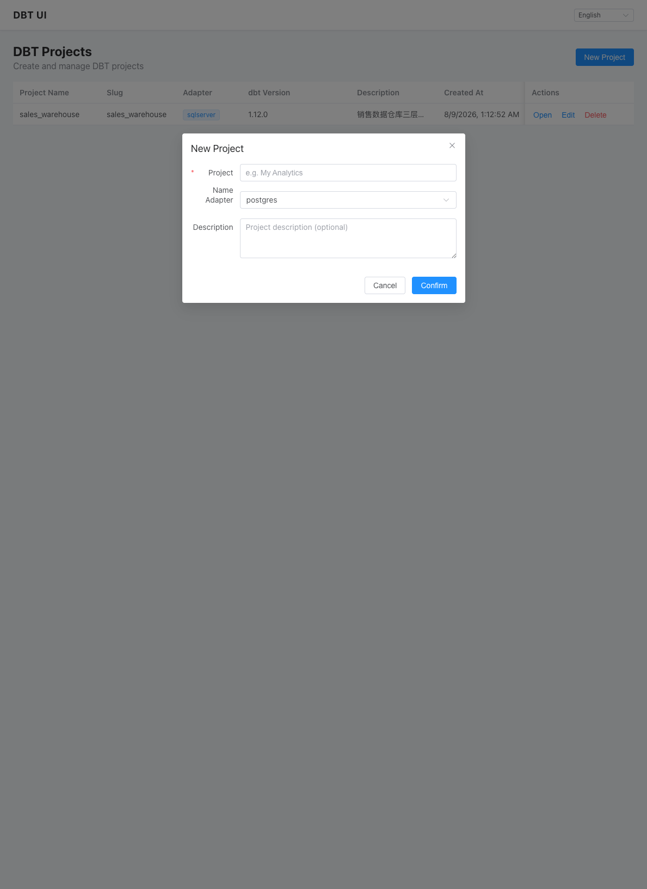

**Form Field Description:**
- **Project Name**: Project name (letters, numbers, underscores only)
- **Adapter**: Select database adapter (this case uses `sqlserver`)
- **Description**: Project description (optional)

> Supported adapters: sqlserver, postgres, snowflake, bigquery.

### 1.3 Filling in Project Information

Fill in the project information in the dialog:
- Project Name: `sales_warehouse`
- Adapter: `sqlserver`
- Description: `Sales data warehouse with three-layer database

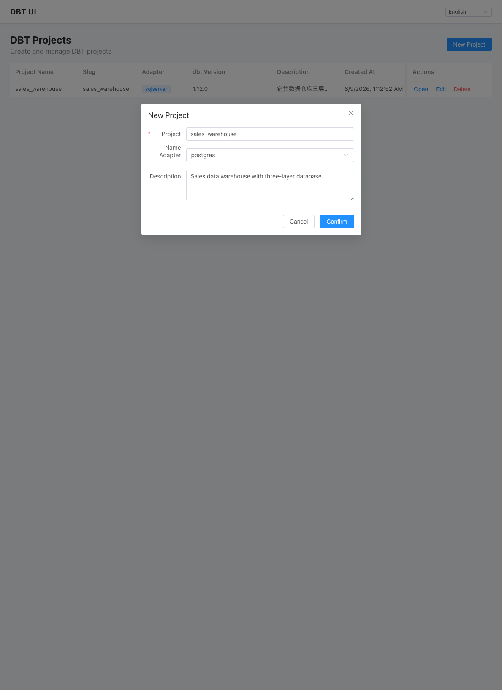

Click the "Confirm" button, and the system will:
1. Create dbt project scaffolding on disk (models/staging, models/core, models/marts, etc.)
2. Automatically generate SQL Server connection configuration (profiles.yml)
3. Automatically configure three-layer database (allocate database by directory in dbt_project.yml)
4. Execute the first `dbt parse`
5. The project appears in the list

### 1.4 Project Created Successfully

After the project is successfully created, the newly created project will appear in the list.

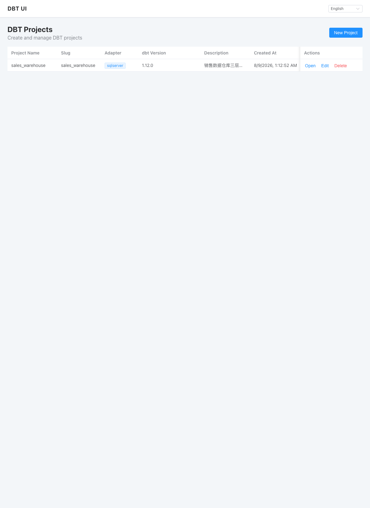

You can see the Adapter column shows `sqlserver`.

### 1.5 Entering Project Details

Click the "Open" button of the target project in the project list to enter the project detail page.


**Page Structure:**
- Top: Project name, adapter tag (sqlserver), parse status tag
- Top-right: "Connection Config" button, "Re-parse" button
- Tabs below: Models / Sources / Tests / Macros / DAG / Data Viewer / Run History

### 1.6 Connection Configuration (profiles.yml)

Click the "Connection Config" button to view the `profiles.yml` database connection configuration.

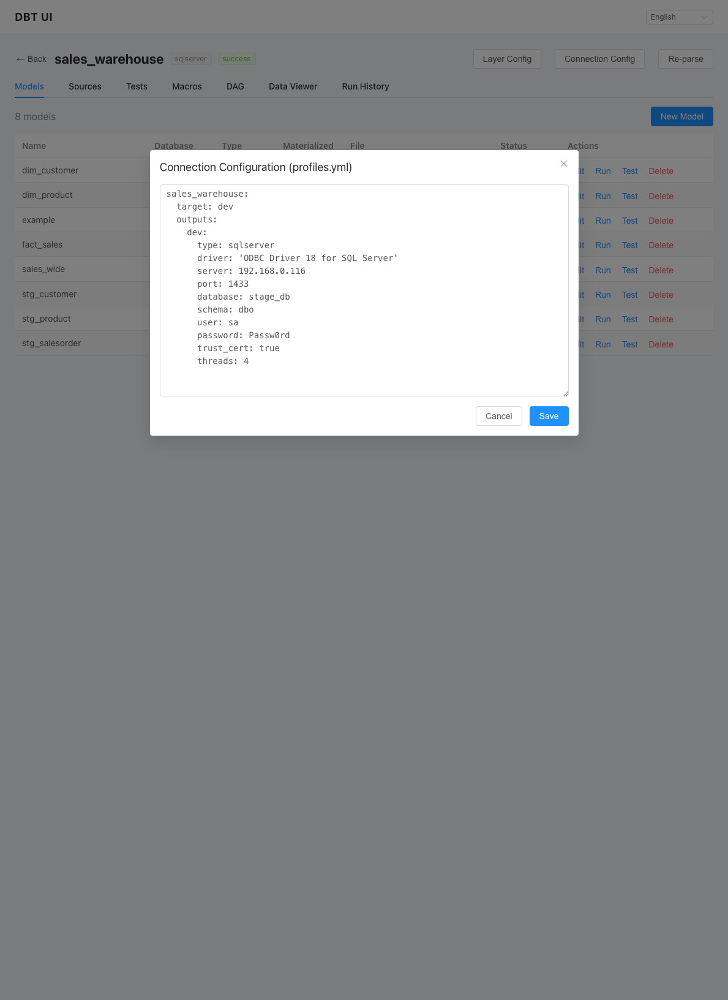

**SQL Server Three-Layer Database Configuration:**
```yaml
sales_warehouse:
  target: dev
  outputs:
    dev:
      type: sqlserver
      driver: 'ODBC Driver 18 for SQL Server'
      server: 192.168.0.116
      port: 1433
      database: stage_db        # Main connection points to stage_db
      schema: dbo
      user: sa
      password: Passw0rd
      trust_cert: true          # Trust self-signed certificate
      threads: 4
```

> The main connection's `database` points to `stage_db`, but through dbt's `+database` configuration, models can be written to other databases like `core_db`, `mart_db`, etc. SQL Server natively supports cross-database queries (`database.schema.table`).

### 1.7 Re-parse

Click the "Re-parse" button, and the system re-executes `dbt parse` and refreshes all metadata.


After successful parsing, the status tag at the top will update to `success`.

### 1.8 Layer Configuration Entry

At the top of the project detail page, there is a "Layer Config" button for managing the layer structure of the dbt project (i.e., directory-level configuration under `models` in `dbt_project.yml`).


Clicking it opens the layer configuration list dialog, where you can view and manage all layers. See [Chapter 2: Layer Configuration Management](#chapter-2-layer-configuration-management) for detailed operations.

---

## Chapter 2: Layer Configuration Management

dbt projects divide different data layers (such as staging, core, marts) by directory through the `models` configuration in `dbt_project.yml`. Each layer can be configured with independent database, schema, materialization strategy, etc. DBT UI provides a visual layer configuration management interface without manually editing YAML files.

### 2.1 Layer Configuration List

Click the "Layer Config" button at the top of the project detail page to open the layer configuration list dialog.

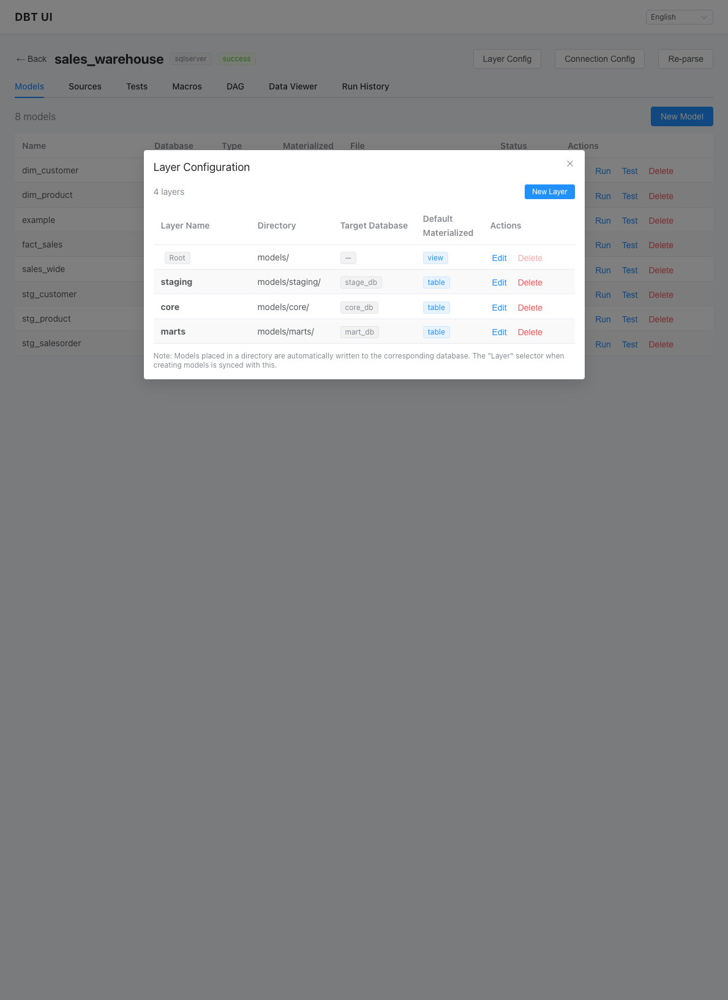

**List Column Description:**
- **Layer Name**: Corresponds to the subdirectory name under `models/` (such as `staging`, `core`, `marts`), the root directory is displayed as "Root"
- **Directory**: Full directory path
- **Target Database**: The target database where models in this layer are written to (`+database`)
- **Default Materialized**: Default materialization strategy for models in this layer (`+materialized`), such as view, table, incremental
- **Actions**: Edit, Delete

> "Display Name" (friendly name, such as "Stage Layer", "Core Layer") is stored in `+meta.display_name` and can be viewed and modified in the **edit dialog**, but not shown on the list page.

> The root directory (`models/` itself) is a special layer, marked as "Root", cannot be deleted or renamed, and is used to configure the default behavior of models in the root directory.

### 2.2 Creating a New Layer

Click the "New Layer" button in the top-right corner of the layer list dialog to open the new layer form.


**Form Field Description:**
- **Display Name**: Friendly display name of the layer (such as "ODS Layer"), optional
- **Directory Name**: Subdirectory name under `models/`, required, letters, numbers, underscores only
- **Database**: Target database where models in this layer are written to (`+database`)
- **Schema**: Default schema for models in this layer (`+schema`), optional
- **Materialized**: Default materialization method for models in this layer (view / table / incremental / ephemeral)

After filling in, click "Confirm", and the system will:
1. Add the corresponding directory configuration under `models.<project_name>` in `dbt_project.yml`
2. Create the corresponding directory under `models/`
3. Automatically re-parse the project

### 2.3 Editing a Layer

Click the "Edit" button of a row in the layer list to open the edit form.

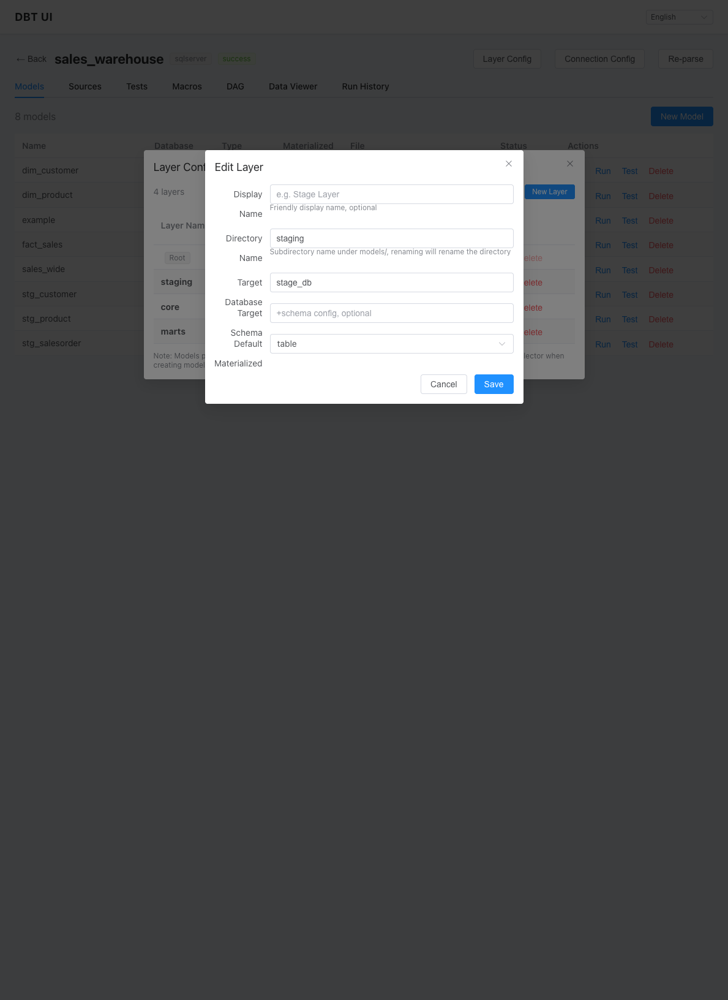

You can modify display name, database, schema, materialization strategy. If you modify the **directory name**, the system will:
1. Rename the entire original directory under `models/` to the new directory name (all model files under the directory are migrated together)
2. Update the configuration key name in `dbt_project.yml`
3. Automatically re-parse the project

> **Directory Rename Note**: The system directly renames the entire directory. If the new directory name conflicts with an existing directory, an error will be prompted. The rename operation records the complete source path and target path in the backend log for troubleshooting.

### 2.4 Deleting a Layer

Click the "Delete" button of a row in the layer list, and delete the layer configuration after confirmation.

> Deleting a layer only deletes the configuration in `dbt_project.yml`, **does **will not delete directories and model files on disk**, to avoid accidental data deletion. After deletion, models in this directory will inherit the configuration of the upper layer (root directory).

### 2.5 Project Default Layers

When creating a SQL Server project, the system automatically creates the following three-layer configuration:

| Display Name | Directory Name | Database | Materialized | Description |
|--------------|----------------|----------|-------------|-------------|
| Stage Layer | `staging` | `stage_db` | table | Staging layer |
| Core Layer | `core` | `core_db` | table | Dimensional modeling core layer |
| Mart Layer | `marts` | `mart_db` | table | Application wide table layer |

These three layers correspond to the SQL Server three-layer database architecture, ready to use out of the box.

---

## Chapter 3: Configuring Source Systems (Sources Visualization)

In the SQL Server version, source data is stored in an independent `sales_db` database. We need to define and reference source tables through dbt's **source** mechanism. DBT UI provides a complete Sources visual management interface without manually editing YAML files.

### 3.1 What is a Source

In dbt, `source` is a declarative definition of source system data tables. Through the Sources management interface, we tell dbt:
- Which database the source data is in (`sales_db`)
- Which schema (`dbo`)
- Which tables (customer / product / salesorder)

After definition, you can use `{{ source('sales_db', 'customer') }}` in model SQL to reference source tables.

### 3.2 Sources Management Interface

Switch to the "Sources" tab on the project detail page to enter the Source management interface.


**Interface Layout:**
- **Left**: Directory tree, showing all sources grouped by directory
- **Right**: Detailed information of the selected source, including basic information and table list
- **Top**: "New Source" button

The left directory tree uses subdirectories under `models/` as groups, and each directory can store multiple source definition files.

### 3.3 Creating a New Source

Click the "New Source" button in the top-left corner to open the new Source dialog.

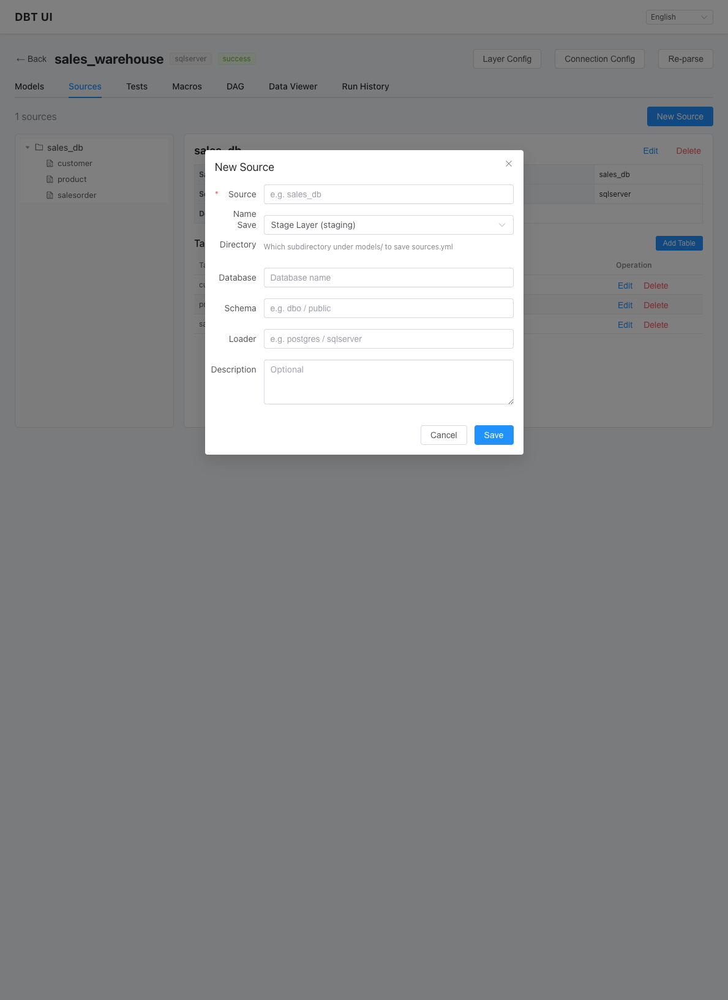

**Form Field Description:**
- **Source Name**: Logical name of the source (used in `{{ source() }}`), such as `sales_db`
- **Database**: Physical database name (database name in SQL Server), such as `sales_db`
- **Schema**: Schema name, usually `dbo` in SQL Server
- **Save Directory**: Select which subdirectory to save `sources.yml` to (such as `staging`, `core`, etc.)
- **Description**: Description information of the source (optional)

After filling in, click "Confirm", and the system will:
1. Create or update the `sources.yml` file in the selected directory
2. Automatically re-parse the project
3. The new source appears in the left directory tree

### 3.4 Viewing Source Details

Click a source in the left directory tree, and the right side shows its detailed information.


**Detail Page Includes:**
- **Basic Information**: Name, Database, Schema, Description, Save Directory
- **Table List**: All source tables under this source, supporting add, edit, delete
- **Action Buttons**: Edit Source, Delete Source

### 3.5 Adding a Source Table

In the table list area of the Source detail page, click the "Add Table" button to open the add table dialog.

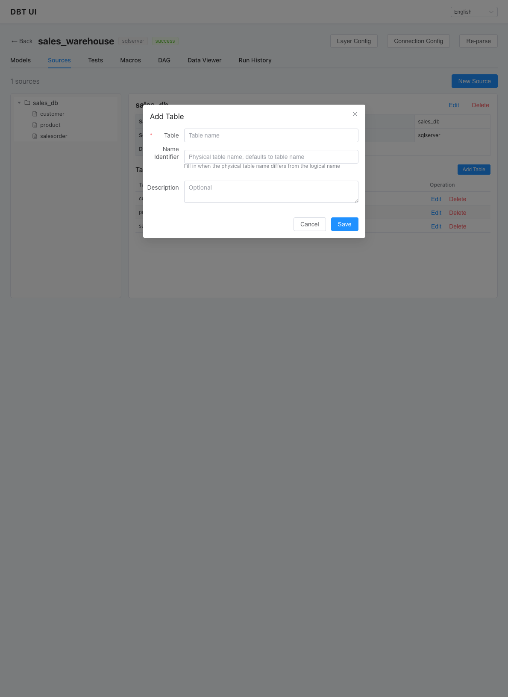

**Table Field Description:**
- **Table Name**: Table name in the source system, such as `customer`
- **Description**: Description information of the table (optional)

We add three tables for the `sales_db` source: `customer`, `product`, `salesorder`.

After adding, the table list looks like this:

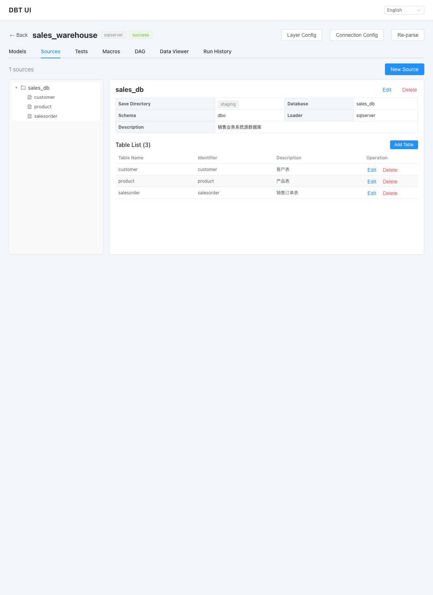

### 3.6 Editing and Deleting

- **Edit Source**: Click the "Edit" button on the detail page to modify name, database, schema, save directory, etc. If you modify the save directory, the system will move the source definition to `sources.yml` under the new directory.
- **Delete Source**: Click the "Delete" button on the detail page, and delete the source and all its table definitions after confirmation. If there is only this one source left in the directory, the empty `sources.yml` file will be automatically cleaned up.
- **Edit Table**: Click the "Edit" button of a row in the table list to modify the table name or description.
- **Delete Table**: Click the "Delete" button of a row in the table list to delete the table definition.

### 3.7 Viewing After Parsing

After the Sources configuration is complete, the system will automatically re-parse. After parsing is complete, you can see source tables (source nodes) in the Models list.


Source nodes will be displayed in the model list, with their "Database" column showing `sales_db` and "Type" column showing `source`.

---

## Chapter 4: Stage Layer — Staging (stage_db)

The Stage layer is the first layer of the data warehouse. All models are written to the `stage_db` database. It is responsible for loading data 1:1 from the source system, performing field name normalization and basic cleaning, and is materialized as tables by default.

### 4.1 Creating a Stage Model

Click the "New Model" button to open the creation dialog.

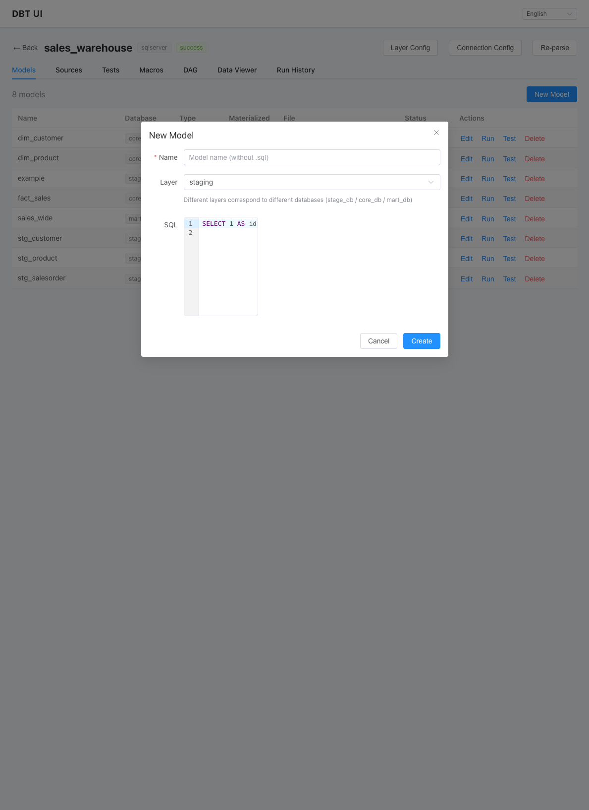

**New Model Dialog Includes:**
- **Name**: Model name (without .sql suffix)
- **Layer**: Select the layer the model belongs to (corresponding to different databases)
  - Stage Layer (staging) → `stage_db`
  - Core Layer (core) → `core_db`
  - Mart Layer (marts) → `mart_db`
  - Root (models) → main database
- **SQL**: SQL code of the model

### 4.2 Writing stg_customer

Let's take `stg_customer` as an example to create the first model of the Stage layer:

1. **Name**: Enter `stg_customer`
2. **Layer**: Select "Stage Layer (staging)" — corresponds to the `stage_db` database
3. **SQL**: Write SQL to load customer data from source

```sql
SELECT
    customer_id,
    customer_name,
    gender,
    age,
    city,
    create_date
FROM {{ source('sales_db', 'customer') }}
```

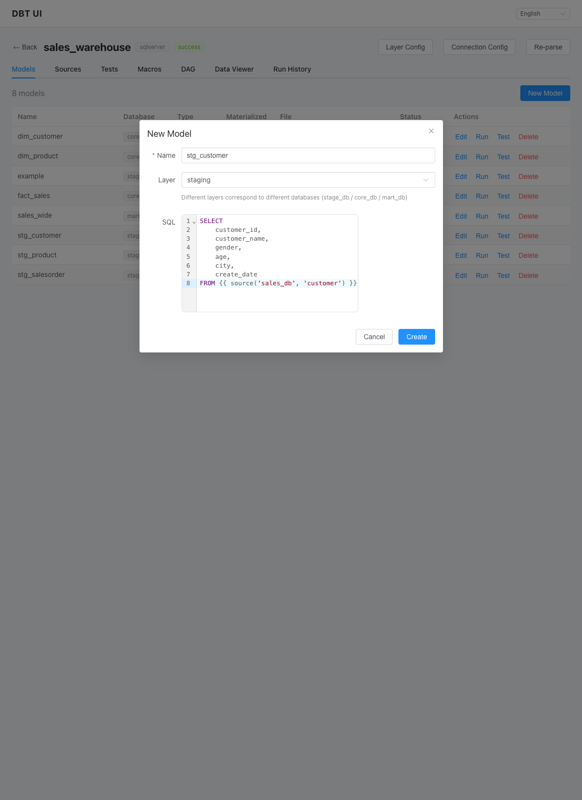

> Note that `{{ source('sales_db', 'customer') }}` is used to reference the source table, not `{{ ref() }}`.
> `source()` is used to reference source system tables, and `ref()` is used to reference dbt models.

Click the "Create" button, and the system will:
1. Create `stg_customer.sql` under the `models/staging/` directory
2. Automatically re-parse the project
3. The new model appears in the list, with the "Database" column showing `stage_db`

### 4.3 Complete Stage Layer Models

In the same way, create the following three Stage layer models:

| Model Name | Database | Materialized | Description | Source |
|------------|----------|--------------|-------------|--------|
| `stg_customer` | stage_db | table | Customer staging table | `{{ source('sales_db', 'customer') }}` |
| `stg_product` | stage_db | table | Product staging table | `{{ source('sales_db', 'product') }}` |
| `stg_salesorder` | stage_db | table | Order staging table | `{{ source('sales_db', 'salesorder') }}` |

**stg_product SQL:
```sql
SELECT
    product_id,
    product_name,
    category,
    price,
    create_date
FROM {{ source('sales_db', 'product') }}
```

**stg_salesorder SQL:**
```sql
SELECT
    order_id,
    order_date,
    customer_id,
    product_id,
    quantity,
    unit_price,
    amount,
    status
FROM {{ source('sales_db', 'salesorder') }}
```

After creation, the model list looks like this:


You can see that all models starting with `stg_` have the "Database" column showing `stage_db` and the "Materialized" column showing `table`.

### 4.4 Running stg_customer

Click the "Run" button in the `stg_customer` row to open the run dialog.


**Run Dialog Description:**
- **Run Type**: `run` (run models) / `test` (run tests) / `compile` (compile only) / `build` (build all)
- **Selection Expression**: dbt `--select` parameter, supporting `model_name`, `model_name+`, `+model_name`, etc.
- Click "Start" to start execution

### 4.5 Running — Real-time Logs

After clicking "Start", the system pushes dbt run logs in real time through WebSocket.


**Real-time Log Features:**
- Dark background in the log area, displaying dbt output line by line
- Running nodes are highlighted with a blue breathing animation in the DAG graph
- Node status changes (running → success/error) are pushed in real time

### 4.6 Run Complete

After the run is complete, the result is displayed at the bottom of the log.


- `✔ Run complete (returncode 0)`: Run successful
- `✘ Run failed (returncode N)`: Run failed, check logs to troubleshoot

After a successful run, the corresponding table will be created in the `stage_db` database.

---

## Chapter 5: Core Layer — Dimensional Modeling (core_db)

The Core layer uses dimensional modeling to organize data into dimension tables and fact tables. All models are written to the `core_db` database and are materialized as tables by default.

### 5.1 Core Layer Model Inventory

| Model Name | Database | Type | Materialized | Description | Upstream Dependency |
|------------|----------|------|--------------|-------------|---------------------|
| `dim_customer` | core_db | Dimension | table | Customer dimension | `stg_customer` (stage_db) |
| `dim_product` | core_db | Dimension | table | Product dimension | `stg_product` (stage_db) |
| `fact_sales` | core_db | Fact | table | Sales facts (completed orders) | `stg_salesorder` (stage_db) |

After creation, the model list looks like this:

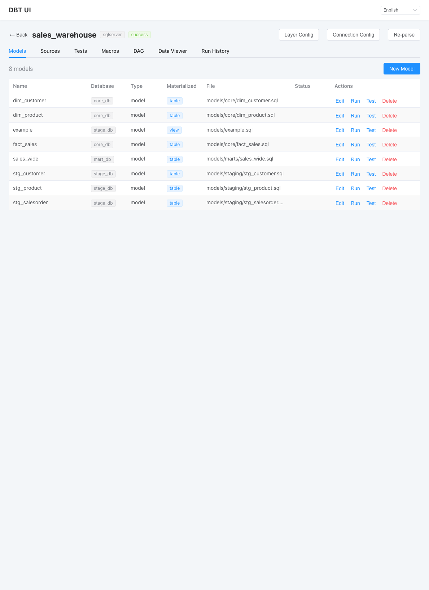

You can see that models starting with `dim_` and `fact_` have the "Database" column showing `core_db`.

> dbt automatically handles cross-database dependencies: `dim_customer` is in `core_db`, but the `stg_customer` it references is in `stage_db`. dbt automatically handles this through SQL Server's cross-database query capability.

**dim_customer SQL:**
```sql
SELECT
    customer_id,
    customer_name,
    gender,
    age,
    city,
    create_date
FROM {{ ref('stg_customer') }}
```

**dim_product SQL:**
```sql
SELECT
    product_id,
    product_name,
    category,
    price,
    create_date
FROM {{ ref('stg_product') }}
```

### 5.2 Editing fact_sales

Click the "Edit" button in the `fact_sales` row to view or modify the fact table SQL.

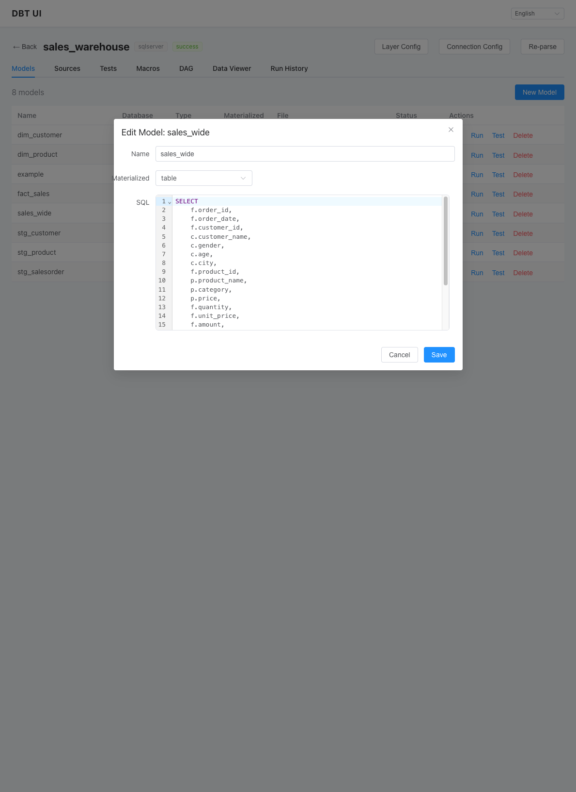

**fact_sales SQL:**
```sql
SELECT
    s.order_id,
    s.order_date,
    s.customer_id,
    s.product_id,
    s.quantity,
    s.unit_price,
    s.amount,
    s.status
FROM {{ ref('stg_salesorder') }} s
WHERE s.status = 'completed'
```

Here we only take orders with `status = 'completed'` as sales facts.

**Edit Dialog Features:**
- Modify model name
- Modify SQL content
- Modify materialization strategy (view / table / incremental / ephemeral)

### 5.3 Running fact_sales

Click the "Run" button in the `fact_sales` row to open the run dialog.

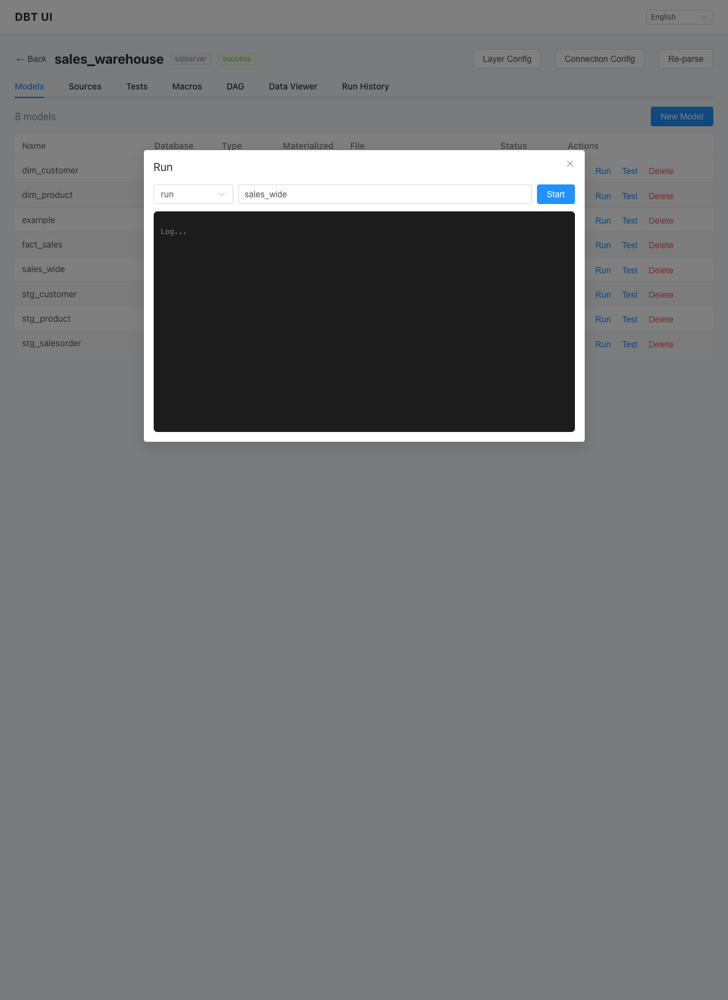

When running `fact_sales`, dbt automatically runs its upstream models in dependency order (including `stg_salesorder` in `stage_db`).

### 5.4 Running

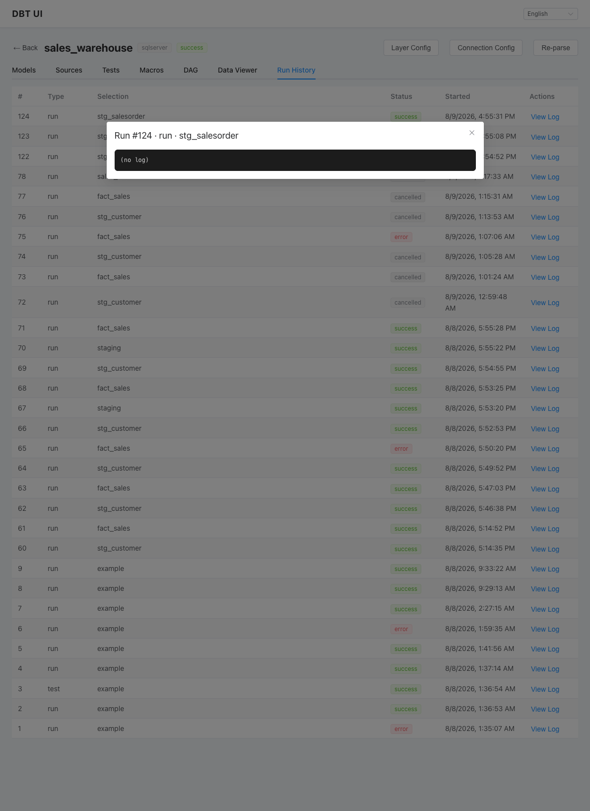

### 5.5 Run Complete


After a successful run, the corresponding dimension tables and fact tables will be created in the `core_db` database.

---

## Chapter 6: Mart Layer — Application Wide Tables (mart_db)

The Mart layer is oriented towards specific business applications, usually building wide tables directly for reporting or data analysis. All models are written to the `mart_db` database and are materialized as tables by default.

### 6.1 Mart Layer Models

| Model Name | Database | Materialized | Description | Upstream Dependency |
|------------|----------|--------------|-------------|---------------------|
| `sales_wide` | mart_db | table | Sales wide table | `fact_sales` + `dim_customer` + `dim_product` |

After creation, the model list looks like this:


The "Database" column of the `sales_wide` model shows `mart_db`.

**sales_wide SQL:**
```sql
SELECT
    f.order_id,
    f.order_date,
    f.customer_id,
    c.customer_name,
    c.gender,
    c.age,
    c.city,
    f.product_id,
    p.product_name,
    p.category,
    p.price,
    f.quantity,
    f.unit_price,
    f.amount,
    f.status
FROM {{ ref('fact_sales') }} f
LEFT JOIN {{ ref('dim_customer') }} c ON f.customer_id = c.customer_id
LEFT JOIN {{ ref('dim_product') }} p ON f.product_id = p.product_id
```

### 6.2 Data Tests

Switch to the Tests tab to manage data quality tests.

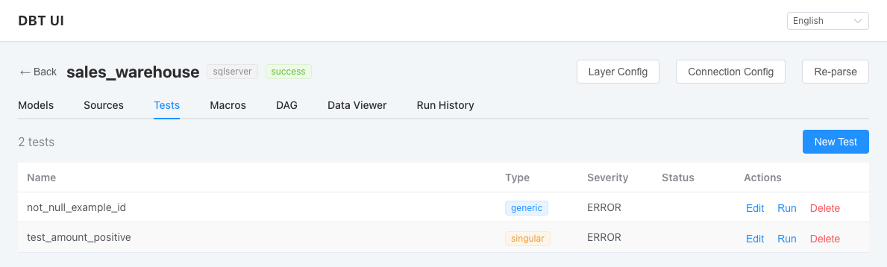

**Test Types:**
- **generic**: Generic tests (such as unique, not_null, accepted_values, etc., defined in schema.yml)
- **singular**: Custom tests, written in SQL (under the `tests/` directory)

### 6.3 Creating a New Test

Click the "New Test" button to open the creation dialog.

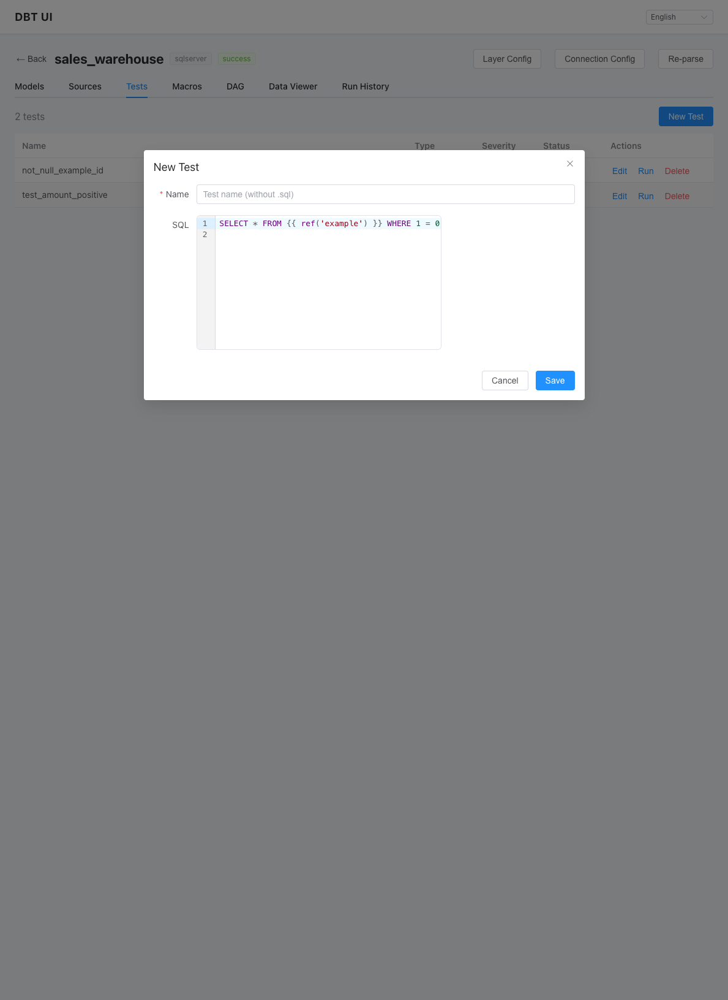

### 6.4 Writing Test SQL

Let's create a test to verify that the sales amount must be positive:

- **Name**: `test_amount_positive`
- **SQL**:
```sql
SELECT *
FROM {{ ref('sales_wide') }}
WHERE amount <= 0
```

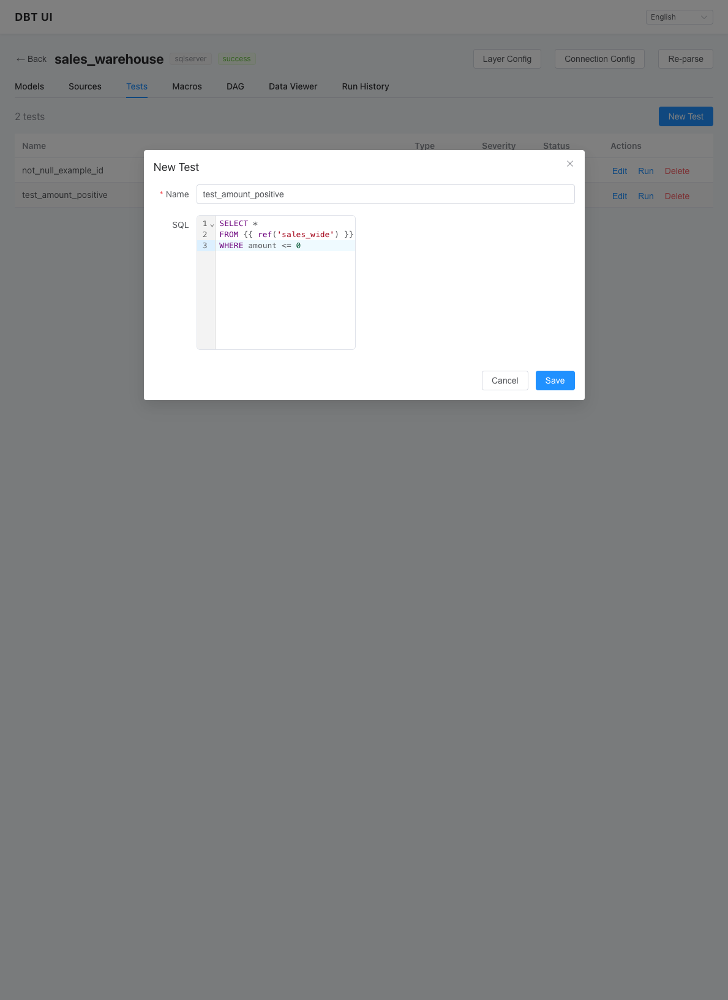

> The logic of the test is: if the SQL returns any rows, the test fails (indicating abnormal data exists).
> Even if the test is in the `tests/` directory, it can access the `sales_wide` table in `mart_db` across databases.

Click the "Save" button, and the system will:
1. Create `test_amount_positive.sql` under the `tests/` directory
2. Automatically re-parse the project
3. The test appears in the list

### 6.5 Test List

After creation, the Tests tab looks like this:


Click the "Run" button of a test row to execute the test and see if it passes.

---

## Chapter 7: Macro Writing and Reuse

dbt's **Macro** is reusable SQL fragments written in Jinja, similar to functions in programming languages. Through Macros, you can abstract repeated SQL logic and reuse it across multiple models, improving code maintainability. DBT UI provides a visual Macro management interface, supporting creating, editing, deleting Macros, and subdirectory classification.

### 7.1 What is a Macro

Macro is one of the most powerful code reuse mechanisms in dbt. Common use scenarios:
- **General calculation logic**: such as amount unit conversion, date formatting, safe division, etc.
- **Custom materialization strategies**: encapsulate complex table creation/insertion logic
- **Cross-model reuse**: multiple models share the same SQL logic
- **Parameterization**: control generated SQL through parameters

Macros are stored in the `macros/` directory with the `.sql` extension, wrapped with `` and ``.

### 7.2 Macros Management Interface

Switch to the "Macros" tab on the project detail page to enter the Macro management interface.

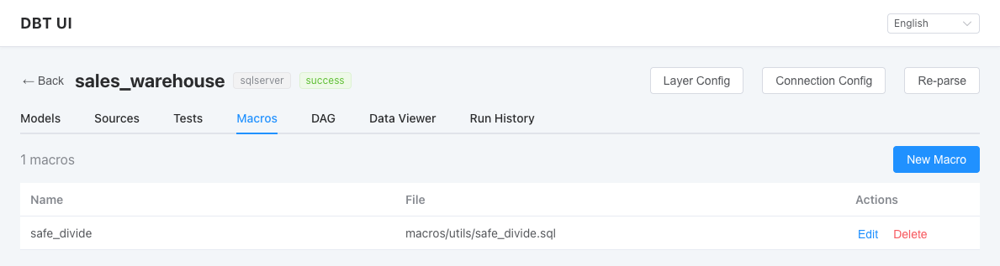

**Interface Description:**
- **List**: Displays all custom Macros in the project, including name and file path
- **New Macro**: Click the button in the top-left corner to create a new Macro
- **Edit**: Modify the name and SQL/Jinja code of the Macro
- **Delete**: Delete the specified Macro

> Note: Only **custom Macros of the current project** are displayed in the list. Built-in dbt Macros and third-party package Macros are not shown here.

### 7.3 Creating a New Macro

Click the "New Macro" button to open the creation dialog.

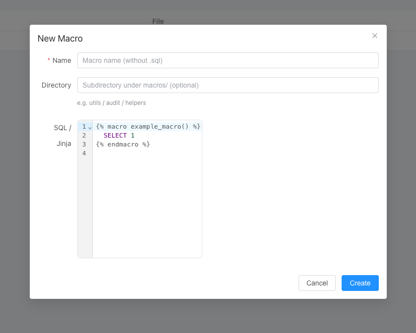

**Form Field Description:**
- **Name**: Name of the Macro (without `.sql` suffix), called via `{{ macro_name() }}` in models
- **Directory**: Subdirectory under `macros/` (optional), used for classification management, such as `utils`, `audit`, `helpers`
- **SQL / Jinja**: Code of the Macro, using `` syntax

After filling in, click "Create", and the system will:
1. Create a `.sql` file in the `macros/` directory (or specified subdirectory)
2. Automatically re-parse the project
3. The new Macro appears in the list

### 7.4 Example: Safe Division Macro

Let's take a practical "safe division" Macro as an example to demonstrate writing and using Macros.

**Scenario**: When calculating unit price (amount ÷ quantity), if the quantity is 0 or NULL, direct division will cause a SQL error. We use a Macro to encapsulate the safe division logic.

**Macro Code:**
```sql

  {#- Safe division: return default value when denominator is zero or null, avoiding SQL errors -#}
  CASE
    WHEN {{ denominator }} = 0 OR {{ denominator }} IS NULL
    THEN {{ default_value }}
    ELSE {{ numerator }} / {{ denominator }}
  END

```

**Parameter Description:**
- `numerator`: Numerator (dividend)
- `denominator`: Denominator (divisor)
- `default_value`: Default return value when denominator is zero, default is 0

### 7.5 Using Macros in Models

After defining the Macro, you can directly call it in the SQL of any model. We use `safe_divide` in the `sales_wide` wide table to calculate the actual unit price:

```sql
SELECT
    f.order_id,
    f.order_date,
    f.customer_id,
    c.customer_name,
    c.gender,
    c.age,
    c.city,
    f.product_id,
    p.product_name,
    p.category,
    p.price,
    f.quantity,
    f.unit_price,
    f.amount,
    f.status,
    -- Use safe_divide macro to calculate actual unit price, avoiding errors when quantity is 0
    {{ safe_divide('f.amount', 'f.quantity') }} AS actual_unit_price
FROM {{ ref('fact_sales') }} f
LEFT JOIN {{ ref('dim_customer') }} c ON f.customer_id = c.customer_id
LEFT JOIN {{ ref('dim_product') }} p ON f.product_id = p.product_id
```

**Call Method**: `{{ safe_divide('f.amount', 'f.quantity') }}`
- The first parameter is the numerator (amount field)
- The second parameter is the denominator (quantity field)
- When the third parameter is omitted, the default value is 0

> Note: Parameters need to be passed in **string** form (with quotes), because dbt replaces them as Jinja variables into the Macro's SQL template.

### 7.6 Editing a Macro

Click the "Edit" button of a Macro row to view and modify the Macro code.

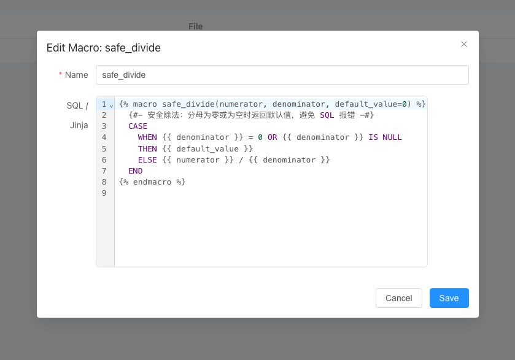

**Edit Dialog Features:**
- Modify Macro name (rename file)
- Modify SQL / Jinja code
- Automatically re-parse the project after saving

> After modifying a Macro, all models that reference the Macro will automatically use the latest version on the next run, without manually modifying model files.

---

## Chapter 8: DAG Lineage Graph

DAG (Directed Acyclic Graph) visually displays dependency relationships between models, including cross-database dependencies and source nodes.

### 8.1 DAG Overview

Switch to the DAG tab to view the complete data flow diagram.


**DAG Graph Description:**
- Each node represents a model, test, or source
- Arrows indicate data flow direction (upstream → downstream)
- Different types of nodes are distinguished by different colors:
  - 🔵 Blue: model
  - 🟢 Green: source
  - 🟡 Orange: test
- Running nodes are highlighted with a blue breathing animation
- Cross-database dependency relationships are also displayed (e.g., sales_db → stage_db → core_db → mart_db)
- The top toolbar supports search, filtering by type, zooming, and refreshing

### 8.2 fact_sales Lineage

Click the `fact_sales` node, and the system highlights all its upstream and downstream lineage chains.


**Interaction Description:**
- Click node: select and highlight lineage chain (upstream + downstream)
- Click again: deselect
- Non-lineage nodes will dim, highlighting dependency relationships

From the diagram, you can see that the upstream of `fact_sales` (core_db) is `stg_salesorder` (stage_db) and the source table `sales_db.salesorder`, and the downstream is `sales_wide` (mart_db).

### 8.3 sales_wide Lineage

Click the `sales_wide` node to view the complete lineage chain of the wide table.

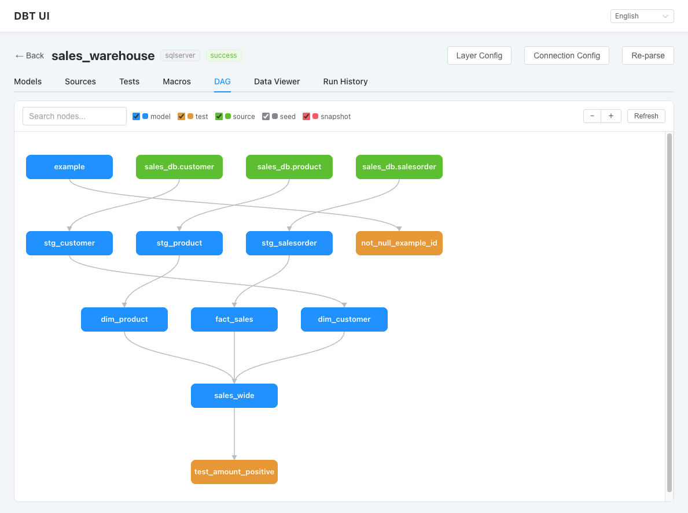

From the diagram, you can clearly see the complete four-layer data flow:
- **Most upstream (source system sales_db)**: `sales_db.customer`, `sales_db.product`, `sales_db.salesorder`
- **Stage Layer (stage_db)**: `stg_customer`, `stg_product`, `stg_salesorder`
- **Core Layer (core_db)**: `dim_customer`, `dim_product`, `fact_sales`
- **Most downstream (mart_db)**: `sales_wide`

---

## Chapter 9: Data Viewer

The Data Viewer provides the ability to directly browse tables and views in the database. You can view table structures (DDL) and data previews, making it convenient to verify whether data is correctly written during development.

> Note: The Data Viewer currently only supports the **SQL Server** adapter.

### 9.1 Interface Overview

Switch to the "Data Viewer" tab on the project detail page to enter the data viewer interface.

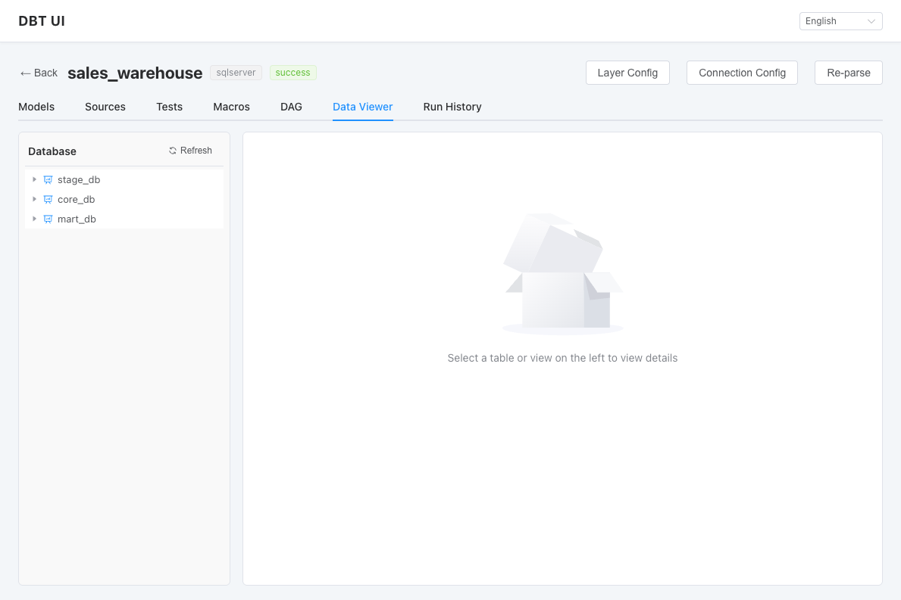

**Interface Layout:**
- **Left**: Database tree, displayed by "Database → Table/View" hierarchy
- **Right**: Details of the selected table, including DDL creation script and data preview
- **Top**: "Refresh" button to reload the database list

### 9.2 Browsing Databases and Tables

The left database tree shows all databases accessible to the current project. Click the database name to expand and view all tables and views under that database.

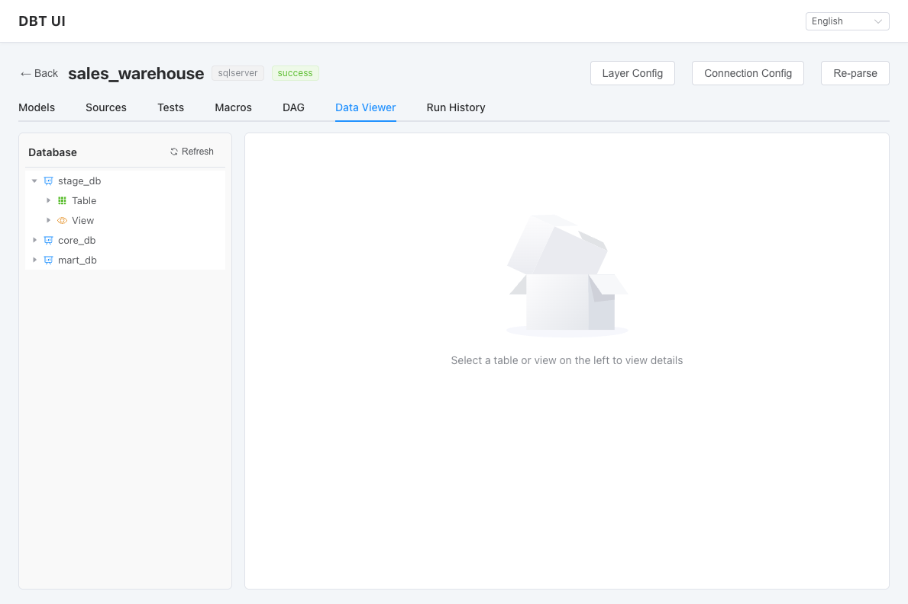

**Tree Node Description:**
- **Database Node**: Displays the database name, click to expand/collapse
- **Table Node**: Displays the table name, icon is Table
- **View Node**: Displays the view name, icon is View

### 9.3 Viewing Table Details

Click a table in the left tree, and the right side shows detailed information about the table.


**The detail page includes two parts:**

**1. DDL Creation Script**
- Displays the complete CREATE TABLE statement of the table
- Includes field names, data types, lengths, nullability, primary keys, and other definitions
- Can be used to understand the table structure

**2. Data Preview**
- Displays the first 1000 rows of data in the table
- Displayed in table form, supporting scrolling browsing
- Used to quickly verify whether data is correctly written

### 9.4 Refreshing Data

Click the "Refresh" button in the top-left corner to reload the latest table list and data from the database.

> Tip: After running models, if the table structure or data has changed, click the "Refresh" button to see the latest results.

---

## Chapter 10: Run History and Logs

### 10.1 Run History List

Switch to the "Run History" tab to view all run records.

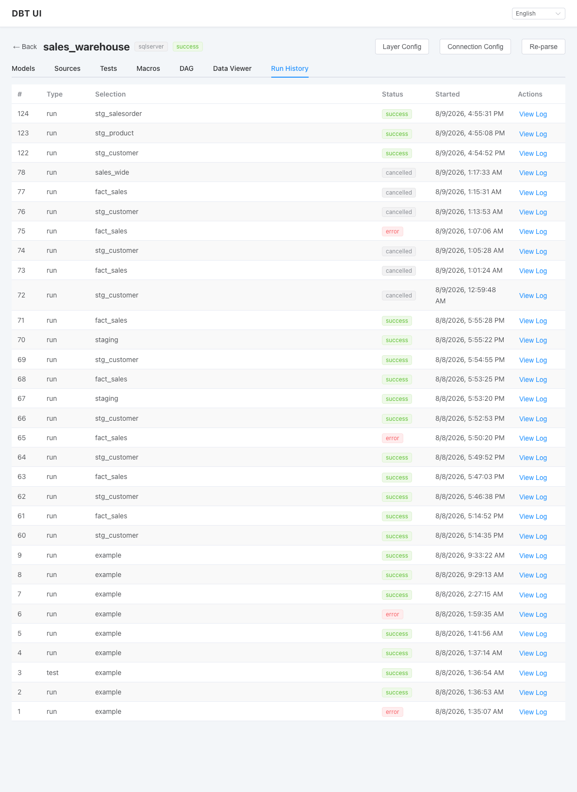

**Table Column Description:**
- **#**: Run number
- **Type**: Run type (run / test / compile / build)
- **Selection**: `--select` expression
- **Status**: success / error / cancelled / running
- **Started**: Run start time
- **Actions**: View log

### 10.2 Viewing Run Logs

Click the "View Log" button to open the log detail dialog.


**Log Dialog Description:**
- The title shows the run number, type, and selection expression
- The content area shows the complete run log
- Can be used to troubleshoot run failure reasons

### 10.3 Returning to the Project List

Click the "← Back" button in the top-left corner to return to the project list page.


---

## Appendix: Model Inventory, Architecture Diagram, FAQ

### Complete Model Inventory

| Layer | Database | Model Name | Type | Materialized | Description |
|-------|----------|------------|------|--------------|-------------|
| Source | sales_db | `sales_db.customer` | source | — | Source system customer table |
| Source | sales_db | `sales_db.product` | source | — | Source system product table |
| Source | sales_db | `sales_db.salesorder` | source | — | Source system order table |
| Stage | stage_db | `stg_customer` | model | table | Customer staging table |
| Stage | stage_db | `stg_product` | model | table | Product staging table |
| Stage | stage_db | `stg_salesorder` | model | table | Order staging table |
| Core | core_db | `dim_customer` | model | table | Customer dimension table |
| Core | core_db | `dim_product` | model | table | Product dimension table |
| Core | core_db | `fact_sales` | model | table | Sales fact table (completed orders) |
| Mart | mart_db | `sales_wide` | model | table | Sales wide table |

### Test Inventory

| Test Name | Type | Target Table | Description |
|-----------|------|--------------|-------------|
| `test_amount_positive` | singular | mart_db.sales_wide | Verify sales amount is positive |

### Macro Inventory

| Macro Name | Directory | Parameters | Description |
|------------|-----------|------------|-------------|
| `safe_divide` | macros/utils/ | numerator, denominator, default_value=0 | Safe division, returns default value when denominator is zero or NULL |

### Data Flow Diagram

```
sales_db (Source System)
┌──────────────────┐
│ sales_db.customer│────┐
├──────────────────┤    │
│ sales_db.product │────│────┐
├──────────────────┤    │    │
│sales_db.salesorder│───│────│────┐
└──────────────────┘    │    │    │
          ↓ source()    │    │    │
stage_db                │    │    │
┌──────────────┐        │    │    │
│ stg_customer │←───────┘    │    │
├──────────────┤             │    │
│ stg_product  │←────────────┘    │
├──────────────┤                  │
│stg_salesorder│←─────────────────┘
└──────────────┘
          ↓ ref()
core_db
┌──────────────┐
│ dim_customer │←──────┐
├──────────────┤       │
│ dim_product  │←──────│──────┐
├──────────────┤       │      │
│ fact_sales   │←──────┘──────┘
└──────────────┘
          ↓ ref()
mart_db
┌──────────────────┐
│   sales_wide     │
└──────────────────┘
```

### profiles.yml Detailed Explanation

```yaml
sales_warehouse:
  target: dev
  outputs:
    dev:
      type: sqlserver
      driver: 'ODBC Driver 18 for SQL Server'   # ODBC driver name
      server: 192.168.0.116                     # SQL Server server address
      port: 1433                                 # Port (default 1433)
      database: stage_db                         # Main connection database
      schema: dbo                                # Default schema
      user: sa                                   # Username
      password: Passw0rd                         # Password
      trust_cert: true                           # Trust self-signed certificate (for development)
      threads: 4                                 # Number of concurrent threads
```

**Key Parameter Description:**
- `driver`: ODBC driver name, must match the driver version installed on the system
- `trust_cert: true`: Commonly used in development environments, skips SSL certificate verification; it is recommended to configure a formal certificate in production environments
- `database`: Main connection database, but models can be written to other databases through `+database` configuration

### dbt_project.yml Layer Configuration

The project's `dbt_project.yml` configures different target databases by directory:

```yaml
models:
  sales_warehouse:
    # Stage Layer — staging, written to stage_db
    staging:
      +database: stage_db
      +materialized: table
    # Core Layer — dimensional modeling, written to core_db
    core:
      +database: core_db
      +materialized: table
    # Mart Layer — application wide tables, written to mart_db
    marts:
      +database: mart_db
      +materialized: table
```

**Rules:**
- Models under the `models/staging/` directory → `stage_db` database
- Models under the `models/core/` directory → `core_db` database
- Models under the `models/marts/` directory → `mart_db` database
- Models under the `models/` root directory → main database (database configured in profiles.yml)
